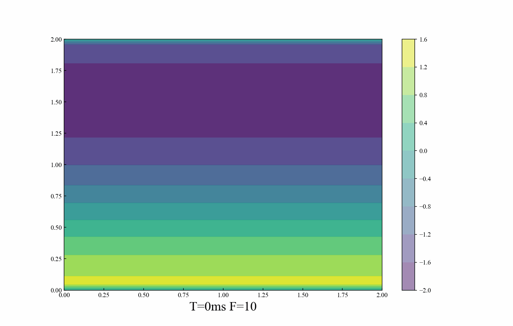

<!-- Author: Howw -->
<!-- Data: 22.8.30 -->

# Description

In this note, I will introduce a channel flow case, solved by Finite Difference Method.

The initial velocity is generated by Taylor_green vortex, with a force in x-axis towards the right, making the fluid moving to the right direction. 

The boundary conditions are: periodic for the inlet and outlet, no-slip for the top and bottom. 

There are two different methods for solving pressure, one is the simple algorithm from Anderson's book, the other is the possion equations. 


## Equations

In this case, there is a source term (F) in the $u$-momentum equation. 
Here are our modified Navier–Stokes equations:

This will solve the Navier–Stokes equations in two dimensions, with boundary conditions.

The momentum equation in vector form for a velocity field $\vec{v}$ is:

$$\frac{\partial \vec{v}}{\partial t}+(\vec{v}\cdot\nabla)\vec{v}=-\frac{1}{\rho}\nabla p + \nu \nabla^2\vec{v}+F_x $$

The continuity equation in vector form for a velocity field $\vec{v}$ is:

$$\nabla ·\overrightarrow{v} =0$$


Continuity：

$$\frac{\partial u}{\partial x}+\frac{\partial v}{\partial y}=0$$


Momentum: 

$$\frac{\partial u}{\partial t}+u\frac{\partial u}{\partial x}+v\frac{\partial u}{\partial y}=-\frac{1}{\rho}\frac{\partial p}{\partial x}+\nu\left(\frac{\partial^2 u}{\partial x^2}+\frac{\partial^2 u}{\partial y^2}\right)+F_x$$

$$\frac{\partial v}{\partial t}+u\frac{\partial v}{\partial x}+v\frac{\partial v}{\partial y}=-\frac{1}{\rho}\frac{\partial p}{\partial y}+\nu\left(\frac{\partial^2 v}{\partial x^2}+\frac{\partial^2 v}{\partial y^2}\right)$$

### Discretization
First, let's discretize the momentum equation, as follows:

The momentum equation is the key to update the velocity with pressure, while the continuity equation is used to midify the pressure. 

$u$-momentum equation: 
$$
\begin{split}
& \frac{u_{i,j}^{n+1}-u_{i,j}^{n}}{\Delta t}+u_{i,j}^{n}\frac{u_{i,j}^{n}-u_{i-1,j}^{n}}{\Delta x}+v_{i,j}^{n}\frac{u_{i,j}^{n}-u_{i,j-1}^{n}}{\Delta y} = \\ 
& \qquad -\frac{1}{\rho}\frac{p_{i+1,j}^{n}-p_{i-1,j}^{n}}{2\Delta x}+\nu\left(\frac{u_{i+1,j}^{n}-2u_{i,j}^{n}+u_{i-1,j}^{n}}{\Delta x^2}+\frac{u_{i,j+1}^{n}-2u_{i,j}^{n}+u_{i,j-1}^{n}}{\Delta y^2}\right) +F_x
\end{split}
$$
$v$-momentum equation:
$$
\begin{split}
&\frac{v_{i,j}^{n+1}-v_{i,j}^{n}}{\Delta t}+u_{i,j}^{n}\frac{v_{i,j}^{n}-v_{i-1,j}^{n}}{\Delta x}+v_{i,j}^{n}\frac{v_{i,j}^{n}-v_{i,j-1}^{n}}{\Delta y} = \\
& \qquad -\frac{1}{\rho}\frac{p_{i,j+1}^{n}-p_{i,j-1}^{n}}{2\Delta y}
+\nu\left(\frac{v_{i+1,j}^{n}-2v_{i,j}^{n}+v_{i-1,j}^{n}}{\Delta x^2}+\frac{v_{i,j+1}^{n}-2v_{i,j}^{n}+v_{i,j-1}^{n}}{\Delta y^2}\right)
\end{split}
$$

### Rearrange

Rearrange the equations in the way that easy for the iterations during calculation

$$u_{i,j}^{n+1} = u_{i,j}^{n}  - \frac{\Delta t}{\rho 2\Delta x} \left(p_{i+1,j}^{n}-p_{i-1,j}^{n}\right)+(A+F_x){\Delta t}$$

$$\begin{split}
A= \left[- \frac {u_{i,j}^{n} }{\Delta x} \left(u_{i,j}^{n}-u_{i-1,j}^{n}\right) -  \frac{v_{i,j}^{n}}{\Delta y} \left(u_{i,j}^{n}-u_{i,j-1}^{n}\right)  + \frac{\nu}{\Delta x^2} \left(u_{i+1,j}^{n}-2u_{i,j}^{n}+u_{i-1,j}^{n}\right) + \frac{\nu}{\Delta y^2} \left(u_{i,j+1}^{n}-2u_{i,j}^{n}+u_{i,j-1}^{n}\right)\right] 
\end{split}
$$

$$ v_{i,j}^{n+1} = v_{i,j}^{n} - - \frac{\Delta t}{\rho 2\Delta y} \left(p_{i,j+1}^{n}-p_{i,j-1}^{n}\right) +B\Delta t $$

$$B=\left[ - \frac{u_{i,j}^{n}}{\Delta x} \left(v_{i,j}^{n}-v_{i-1,j}^{n}\right) -  \frac{v_{i,j}^{n}}{\Delta y} \left(v_{i,j}^{n}-v_{i,j-1}^{n})\right) +  \frac{\nu}{\Delta x^2}\left( v_{i+1,j}^{n}-2v_{i,j}^{n}+v_{i-1,j}^{n}\right) + \frac{\nu}{\Delta y^2} \left(v_{i,j+1}^{n}-2v_{i,j}^{n}+v_{i,j-1}^{n}\right)
\right]$$

### Pressure modification Method 1: Simple algorithm

$$p^{n+1}_{i,j}=p^{n}_{i,j}+\alpha_n p'_{i,j}$$

In which, $\alpha_n$ is the relaxation factor, herein, we set as 0.1

$$ap'_{i,j}+bp'_{i+1,j}+bp'_{i-1,j}+cp'_{i,j+1}cp'_{i,j-1}+d=0$$

$$b=-\frac{1}{\rho}\frac{\Delta t}{(\Delta x)^2}$$

$$c=-\frac{1}{\rho}\frac{\Delta t}{(\Delta y)^2}$$

$$a=\frac{2}{\rho}\left[\frac{\Delta t}{(\Delta x)^2}+\frac{\Delta t}{(\Delta y)^2}\right]=-2(b+c)$$

$$d=\frac{1}{\Delta x}\left[ u^n_{i+1,j}-u^n_{i-1,j}\right]+\frac{1}{\Delta y}\left[ v^n_{i,j+1}-v^n_{i,j-1}\right]$$

### Pressure modification Method 2: Passion Equation

$$\frac{\partial^2 p}{\partial x^2}+\frac{\partial^2 p}{\partial y^2} = -\rho\left(\frac{\partial u}{\partial x}\frac{\partial u}{\partial x}+2\frac{\partial u}{\partial y}\frac{\partial v}{\partial x}+\frac{\partial v}{\partial y}\frac{\partial v}{\partial y} \right)$$

#### Discretization

$$ 
\begin{split}
& \frac{p_{i+1,j}^{n}-2p_{i,j}^{n}+p_{i-1,j}^{n}}{\Delta x^2}+\frac{p_{i,j+1}^{n}-2p_{i,j}^{n}+p_{i,j-1}^{n}}{\Delta y^2} = \\
& \qquad \rho \left[ \frac{1}{\Delta t}\left(\frac{u_{i+1,j}-u_{i-1,j}}{2\Delta x}+\frac{v_{i,j+1}-v_{i,j-1}}{2\Delta y}\right) -\frac{u_{i+1,j}-u_{i-1,j}}{2\Delta x}\frac{u_{i+1,j}-u_{i-1,j}}{2\Delta x} - 2\frac{u_{i,j+1}-u_{i,j-1}}{2\Delta y}\frac{v_{i+1,j}-v_{i-1,j}}{2\Delta x} - \frac{v_{i,j+1}-v_{i,j-1}}{2\Delta y}\frac{v_{i,j+1}-v_{i,j-1}}{2\Delta y}\right]
\end{split}
$$

#### Rearrange

$$
\begin{split}
p_{i,j}^{n} = & \frac{\left(p_{i+1,j}^{n}+p_{i-1,j}^{n}\right) \Delta y^2 + \left(p_{i,j+1}^{n}+p_{i,j-1}^{n}\right) \Delta x^2}{2\left(\Delta x^2+\Delta y^2\right)} \\
& -\frac{\rho\Delta x^2\Delta y^2}{2\left(\Delta x^2+\Delta y^2\right)} \\
& \times \left[\frac{1}{\Delta t}\left(\frac{u_{i+1,j}-u_{i-1,j}}{2\Delta x}+\frac{v_{i,j+1}-v_{i,j-1}}{2\Delta y}\right)-\frac{u_{i+1,j}-u_{i-1,j}}{2\Delta x}\frac{u_{i+1,j}-u_{i-1,j}}{2\Delta x} -2\frac{u_{i,j+1}-u_{i,j-1}}{2\Delta y}\frac{v_{i+1,j}-v_{i-1,j}}{2\Delta x}-\frac{v_{i,j+1}-v_{i,j-1}}{2\Delta y}\frac{v_{i,j+1}-v_{i,j-1}}{2\Delta y}\right]
\end{split}
$$

Assuming the b equals to: 
$$\qquad \rho \left[ \frac{1}{\Delta t}\left(\frac{u_{i+1,j}-u_{i-1,j}}{2\Delta x}+\frac{v_{i,j+1}-v_{i,j-1}}{2\Delta y}\right) -\frac{u_{i+1,j}-u_{i-1,j}}{2\Delta x}\frac{u_{i+1,j}-u_{i-1,j}}{2\Delta x} - 2\frac{u_{i,j+1}-u_{i,j-1}}{2\Delta y}\frac{v_{i+1,j}-v_{i-1,j}}{2\Delta x} - \frac{v_{i,j+1}-v_{i,j-1}}{2\Delta y}\frac{v_{i,j+1}-v_{i,j-1}}{2\Delta y}\right]
$$

Then
$$
\begin{split}
p_{i,j}^{n} = & \frac{\left(p_{i+1,j}^{n}+p_{i-1,j}^{n}\right) \Delta y^2 + \left(p_{i,j+1}^{n}+p_{i,j-1}^{n}\right) \Delta x^2}{2\left(\Delta x^2+\Delta y^2\right)}  -\frac{b \Delta x^2\Delta y^2}{2\left(\Delta x^2+\Delta y^2\right)}
\end{split}
$$

## Initial and boundary condition

The initial condition is $u, v, p=0$ everywhere. 

**boundary conditions**:

$u, v, p$ are periodic on $x=0,2$

$u, v =0$ at $y =0,2$

$\frac{\partial p}{\partial y}=0$ at $y =0,2$

$F=1$ everywhere.

## Code

Let's Coding!

```python
import numpy as np
from matplotlib import pyplot as plt
from matplotlib import cm

def cal_A(dx,dy,nu,u_in,v_in):
    u=u_in.copy().astype(np.float32)
    v=v_in.copy().astype(np.float32)
    A=np.zeros_like(u).astype(np.float32)
    #interior
    A[1:-1,1:-1]=-u[1:-1,1:-1]/dx*(u[1:-1,1:-1]-u[1:-1,0:-2])\
                 -v[1:-1,1:-1]/dy*(u[1:-1,1:-1]-u[0:-2,1:-1])\
                 +nu/((dx)**2)*(u[1:-1,2:]-2*u[1:-1,1:-1]+u[1:-1,0:-2])\
                 +nu/((dy)**2)*(u[2:,1:-1]-2*u[1:-1,1:-1]+u[0:-2,1:-1])

    #periodic boundary x=0
    A[1:-1,0]=-u[1:-1,0]/dx*(u[1:-1,0]-u[1:-1,-1])\
              -v[1:-1,0]/dy*(u[1:-1,0]-u[0:-2,0])\
              +nu/((dx)**2)*(u[1:-1,1]-2*u[1:-1,0]+u[1:-1,-1])\
              +nu/((dy)**2)*(u[2:,0]-2*u[1:-1,0]+u[0:-2,0])

    #periodic boundary x=2
    A[1:-1,-1]=-u[1:-1,-1]/dx*(u[1:-1,-1]-u[1:-1,-2])\
              -v[1:-1,0]/dy*(u[1:-1,-1]-u[0:-2,-1])\
              +nu/((dx)**2)*(u[1:-1,-2]-2*u[1:-1,-1]+u[1:-1,0])\
              +nu/((dy)**2)*(u[2:,-1]-2*u[1:-1,-1]+u[0:-2,-1])

    return A

def cal_B(dx,dy,nu,u_in,v_in):
    u=u_in.copy().astype(np.float32)
    v=v_in.copy().astype(np.float32)
    B=np.zeros_like(u).astype(np.float32)
    B[1:-1,1:-1]=-u[1:-1,1:-1]/dx*(v[1:-1,1:-1]-v[1:-1,0:-2])\
                 -v[1:-1,1:-1]/dy*(v[1:-1,1:-1]-v[0:-2,1:-1])\
                 +((dx)**2)*(v[1:-1,2:]-2*v[1:-1,1:-1]+v[1:-1,0:-2])\
                 +nu/((dy)**2)*(v[2:,1:-1]-2*v[1:-1,1:-1]+v[0:-2,1:-1])
    #periodic boundary x=0
    B[1:-1,0]=-u[1:-1,0]/dx*(v[1:-1,0]-v[1:-1,-1])\
              -v[1:-1,0]/dy*(v[1:-1,0]-v[0:-2,0])\
              +nu/((dx)**2)*(v[1:-1,1]-2*v[1:-1,0]+v[1:-1,-1])\
              +nu/((dy)**2)*(v[2:,0]-2*v[1:-1,0]+v[0:-2,0])
    #periodic boundary x=2
    B[1:-1,-1]=-u[1:-1,-1]/dx*(v[1:-1,-1]-v[1:-1,-2])\
              -v[1:-1,-1]/dy*(v[1:-1,-1]-v[0:-2,-1])\
              +nu/((dx)**2)*(v[1:-1,-2]-2*v[1:-1,-1]+v[1:-1,0])\
              +nu/((dy)**2)*(v[2:,-1]-2*v[1:-1,-1]+v[0:-2,-1])
    return B

#this is the SIMPLE algorithm for pressure (method 1)
def cal_p(nit,dx,dy,dt,rho,p,u,v):
    p_n=np.zeros_like(p)
    d=np.zeros_like(p)
    b=-(dt/rho)*(dx**2)
    c=-(dt/rho)*(dy**2)
    a=2*((dt/(dx)**2)+(dt/(dy)**2))
    d[1:-1,1:-1]=(1/dx)*(u[1:-1,2:]- u[1:-1, 0:-2])+(1/dy)*(v[2:, 1:-1] - v[0:-2, 1:-1])
    d[1:-1,0]=(1/dx)*(u[1:-1,1]- u[1:-1, -1])+(1/dy)*(v[2:, 0] - v[0:-2, 0])
    d[1:-1,-1]=(1/dx)*(u[1:-1,0]- u[1:-1, -2])+(1/dy)*(v[2:, -1] - v[0:-2, -1])

    # print("d:",d.max())
    error=1
    for i in range(nit):
        p_n_old=p_n.copy()
        p_n[1:-1,1:-1]=-1/a*(b*p_n[1:-1,2:]+b*p_n[1:-1,0:-2]+c*p_n[2:,1:-1]+c*p_n[0:-2,1:-1]+d[1:-1,1:-1])
        p_n[1:-1,0]=-1/a*(b*p_n[1:-1,1]+b*p_n[1:-1,-1]+c*p_n[2:,0]+c*p_n[0:-2,0]+d[1:-1,0])
        p_n[1:-1,-1]=-1/a*(b*p_n[1:-1,0]+b*p_n[1:-1,-2]+c*p_n[2:,-1]+c*p_n[0:-2,-1]+d[1:-1,-1])

        error=(p_n-p_n_old).max()

    p=p+0.1*p_n
    # Wall boundary conditions, pressure
    p[-1, :] =p[-2, :]  # dp/dy = 0 at y = 2
    p[0, :] = p[1, :]  # dp/dy = 0 at y = 0
    # print("P:",p.max())
    # print("----------------------")
    
    return p

#this solves Possion Equations for pressure (method 2)
def build_up_b(rho, dt, dx, dy, u, v):
    b = np.zeros_like(u)
    b[1:-1, 1:-1] = (rho * (1 / dt * ((u[1:-1, 2:] - u[1:-1, 0:-2]) / (2 * dx) +
                                      (v[2:, 1:-1] - v[0:-2, 1:-1]) / (2 * dy)) -
                            ((u[1:-1, 2:] - u[1:-1, 0:-2]) / (2 * dx))**2 -
                            2 * ((u[2:, 1:-1] - u[0:-2, 1:-1]) / (2 * dy) *
                                 (v[1:-1, 2:] - v[1:-1, 0:-2]) / (2 * dx))-
                            ((v[2:, 1:-1] - v[0:-2, 1:-1]) / (2 * dy))**2))
    
    # Periodic BC Pressure @ x = 2
    b[1:-1, -1] = (rho * (1 / dt * ((u[1:-1, 0] - u[1:-1,-2]) / (2 * dx) +
                                    (v[2:, -1] - v[0:-2, -1]) / (2 * dy)) -
                          ((u[1:-1, 0] - u[1:-1, -2]) / (2 * dx))**2 -
                          2 * ((u[2:, -1] - u[0:-2, -1]) / (2 * dy) *
                               (v[1:-1, 0] - v[1:-1, -2]) / (2 * dx)) -
                          ((v[2:, -1] - v[0:-2, -1]) / (2 * dy))**2))

    # Periodic BC Pressure @ x = 0
    b[1:-1, 0] = (rho * (1 / dt * ((u[1:-1, 1] - u[1:-1, -1]) / (2 * dx) +
                                   (v[2:, 0] - v[0:-2, 0]) / (2 * dy)) -
                         ((u[1:-1, 1] - u[1:-1, -1]) / (2 * dx))**2 -
                         2 * ((u[2:, 0] - u[0:-2, 0]) / (2 * dy) *
                              (v[1:-1, 1] - v[1:-1, -1]) / (2 * dx))-
                         ((v[2:, 0] - v[0:-2, 0]) / (2 * dy))**2))
    
    return b

def pressure_poisson_periodic(nit,p,b, dx, dy):
    pn = np.empty_like(p)
    
    for q in range(nit):
        pn = p.copy()
        p[1:-1, 1:-1] = (((pn[1:-1, 2:] + pn[1:-1, 0:-2]) * dy**2 +
                          (pn[2:, 1:-1] + pn[0:-2, 1:-1]) * dx**2) /
                         (2 * (dx**2 + dy**2)) -
                         dx**2 * dy**2 / (2 * (dx**2 + dy**2)) * b[1:-1, 1:-1])

        # Periodic BC Pressure @ x = 2
        p[1:-1, -1] = (((pn[1:-1, 0] + pn[1:-1, -2])* dy**2 +
                        (pn[2:, -1] + pn[0:-2, -1]) * dx**2) /
                       (2 * (dx**2 + dy**2)) -
                       dx**2 * dy**2 / (2 * (dx**2 + dy**2)) * b[1:-1, -1])

        # Periodic BC Pressure @ x = 0
        p[1:-1, 0] = (((pn[1:-1, 1] + pn[1:-1, -1])* dy**2 +
                       (pn[2:, 0] + pn[0:-2, 0]) * dx**2) /
                      (2 * (dx**2 + dy**2)) -
                      dx**2 * dy**2 / (2 * (dx**2 + dy**2)) * b[1:-1, 0])
        
        # Wall boundary conditions, pressure
        p[-1, :] =p[-2, :]  # dp/dy = 0 at y = 2
        p[0, :] = p[1, :]  # dp/dy = 0 at y = 0
    
    return p


##variable declarations
nx = 41
ny = 41
nt = 100
nit = 50 
c = 1
L=2
dx = L / (nx - 1)
dy = L / (ny - 1)
x = np.linspace(0, L, nx)
y = np.linspace(0, L, ny)
X, Y = np.meshgrid(x, y)


##physical variables
rho = 1
nu = .1
F = 10
dt = .01

#initial conditions
u = np.zeros((ny, nx))
un = np.zeros((ny, nx))


v = np.zeros((ny, nx))
vn = np.zeros((ny, nx))


p = np.ones((ny, nx))
pn = np.ones((ny, nx))

b = np.zeros((ny, nx))

#SIMPLE algorithm
def channel_1(nt,nit,dx,dy,dt,nu,rho,u_in,v_in,b_in,p_in):
    # use `copy()` to avoid local varibles affect the global varibles
    u=u_in.copy()
    v=v_in.copy()
    p=p_in.copy()
    b=b_in.copy()
    u_old=np.zeros_like(u)
    v_old=np.zeros_like(v)
    for n in range(nt):
        u_old=u.copy()
        v_old=v.copy()
        p=cal_p(nit,dx,dy,dt,rho,p,u,v)
        A=cal_A(dx,dy,nu,u,v)
        B=cal_B(dx,dy,nu,u,v)
        u[1:-1,1:-1]=u_old[1:-1,1:-1]-dt/(rho*2*dx)*(p[1:-1,2:]-p[1:-1,0:-2])+(A[1:-1,1:-1]+F)*dt
        u[1:-1,0]=u_old[1:-1,0]-dt/(rho*2*dx)*(p[1:-1,1]-p[1:-1,-1])+(A[1:-1,0]+F)*dt
        u[1:-1,-1]=u_old[1:-1,-1]-dt/(rho*2*dx)*(p[1:-1,0]-p[1:-1,-2])+(A[1:-1,-1]+F)*dt

        v[1:-1,1:-1]=v_old[1:-1,1:-1]-dt/(rho*2*dy)*(p[2:,1:-1]-p[0:-2,1:-1])+B[1:-1,1:-1]*dt
        v[1:-1,-1]=v_old[1:-1,-1]-dt/(rho*2*dy)*(p[2:,-1]-p[0:-2,-1])+B[1:-1,-1]*dt       
        v[1:-1,0]=v_old[1:-1,0]-dt/(rho*2*dy)*(p[2:,0]-p[0:-2,0])+B[1:-1,0]*dt
        # Wall BC: u,v = 0 @ y = 0,2
        u[0, :] = 0
        u[-1, :] = 0
        v[0, :] = 0
        v[-1, :]=0            
    return u,v,p

#possion algorithm for pressure
def channel_2(nt,nit,dx,dy,dt,nu,rho,u_in,v_in,b_in,p_in):
    u=u_in.copy()
    v=v_in.copy()
    p=p_in.copy()
    b=b_in.copy()
    u_old=np.zeros_like(u)
    v_old=np.zeros_like(v)
    for n in range(nt):
        un = u.copy()
        vn = v.copy()

        b = build_up_b(rho, dt, dx, dy, u, v)
        p = pressure_poisson_periodic(nit,p,b, dx, dy)

        u[1:-1, 1:-1] = (un[1:-1, 1:-1] -
                        un[1:-1, 1:-1] * dt / dx * 
                        (un[1:-1, 1:-1] - un[1:-1, 0:-2]) -
                        vn[1:-1, 1:-1] * dt / dy * 
                        (un[1:-1, 1:-1] - un[0:-2, 1:-1]) -
                        dt / (2 * rho * dx) * 
                        (p[1:-1, 2:] - p[1:-1, 0:-2]) +
                        nu * (dt / dx**2 * 
                        (un[1:-1, 2:] - 2 * un[1:-1, 1:-1] + un[1:-1, 0:-2]) +
                        dt / dy**2 * 
                        (un[2:, 1:-1] - 2 * un[1:-1, 1:-1] + un[0:-2, 1:-1])) + 
                        F * dt)

        v[1:-1, 1:-1] = (vn[1:-1, 1:-1] -
                        un[1:-1, 1:-1] * dt / dx * 
                        (vn[1:-1, 1:-1] - vn[1:-1, 0:-2]) -
                        vn[1:-1, 1:-1] * dt / dy * 
                        (vn[1:-1, 1:-1] - vn[0:-2, 1:-1]) -
                        dt / (2 * rho * dy) * 
                        (p[2:, 1:-1] - p[0:-2, 1:-1]) +
                        nu * (dt / dx**2 *
                        (vn[1:-1, 2:] - 2 * vn[1:-1, 1:-1] + vn[1:-1, 0:-2]) +
                        dt / dy**2 * 
                        (vn[2:, 1:-1] - 2 * vn[1:-1, 1:-1] + vn[0:-2, 1:-1])))

        # Periodic BC u @ x = 2     
        u[1:-1, -1] = (un[1:-1, -1] - un[1:-1, -1] * dt / dx * 
                    (un[1:-1, -1] - un[1:-1, -2]) -
                    vn[1:-1, -1] * dt / dy * 
                    (un[1:-1, -1] - un[0:-2, -1]) -
                    dt / (2 * rho * dx) *
                    (p[1:-1, 0] - p[1:-1, -2]) + 
                    nu * (dt / dx**2 * 
                    (un[1:-1, 0] - 2 * un[1:-1,-1] + un[1:-1, -2]) +
                    dt / dy**2 * 
                    (un[2:, -1] - 2 * un[1:-1, -1] + un[0:-2, -1])) + F * dt)

        # Periodic BC u @ x = 0
        u[1:-1, 0] = (un[1:-1, 0] - un[1:-1, 0] * dt / dx *
                    (un[1:-1, 0] - un[1:-1, -1]) -
                    vn[1:-1, 0] * dt / dy * 
                    (un[1:-1, 0] - un[0:-2, 0]) - 
                    dt / (2 * rho * dx) * 
                    (p[1:-1, 1] - p[1:-1, -1]) + 
                    nu * (dt / dx**2 * 
                    (un[1:-1, 1] - 2 * un[1:-1, 0] + un[1:-1, -1]) +
                    dt / dy**2 *
                    (un[2:, 0] - 2 * un[1:-1, 0] + un[0:-2, 0])) + F * dt)

        # Periodic BC v @ x = 2
        v[1:-1, -1] = (vn[1:-1, -1] - un[1:-1, -1] * dt / dx *
                    (vn[1:-1, -1] - vn[1:-1, -2]) - 
                    vn[1:-1, -1] * dt / dy *
                    (vn[1:-1, -1] - vn[0:-2, -1]) -
                    dt / (2 * rho * dy) * 
                    (p[2:, -1] - p[0:-2, -1]) +
                    nu * (dt / dx**2 *
                    (vn[1:-1, 0] - 2 * vn[1:-1, -1] + vn[1:-1, -2]) +
                    dt / dy**2 *
                    (vn[2:, -1] - 2 * vn[1:-1, -1] + vn[0:-2, -1])))

        # Periodic BC v @ x = 0
        v[1:-1, 0] = (vn[1:-1, 0] - un[1:-1, 0] * dt / dx *
                    (vn[1:-1, 0] - vn[1:-1, -1]) -
                    vn[1:-1, 0] * dt / dy *
                    (vn[1:-1, 0] - vn[0:-2, 0]) -
                    dt / (2 * rho * dy) * 
                    (p[2:, 0] - p[0:-2, 0]) +
                    nu * (dt / dx**2 * 
                    (vn[1:-1, 1] - 2 * vn[1:-1, 0] + vn[1:-1, -1]) +
                    dt / dy**2 * 
                    (vn[2:, 0] - 2 * vn[1:-1, 0] + vn[0:-2, 0])))


        # Wall BC: u,v = 0 @ y = 0,2
        u[0, :] = 0
        u[-1, :] = 0
        v[0, :] = 0
        v[-1, :]=0
    return u,v,p
```

Here shows the resluts, which the initial velocity is generated by Taylor_green vortex, with a force in x-axis towards the right, making the fluid moving in the right direction. 

