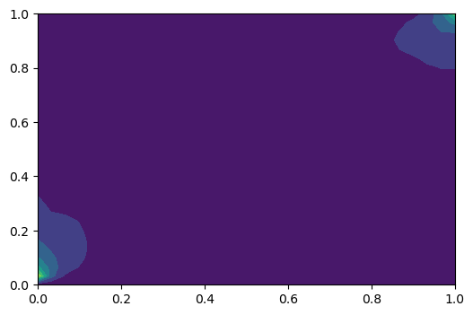
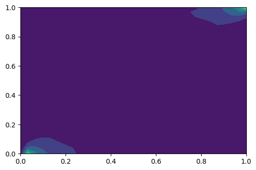

# Projects description

**Purpose:** This is my notes for using Matplotlib to make animation, it's very convenient during your simulation. 


### 1.1 Functions

#### 1.1.1 Basic Functions

Continuity function

$$\frac{\partial (\phi\rho)}{\partial t}+\bigtriangledown\cdot (\rho v) = q\tag{1.1}$$
where $\phi$ is the porosity, $\rho$ is the density, $v$ is the flow velocities and $q$ is the source term which models sources and sinks ( outflow and inflow per volume at designated well locations).

Darcy Law

$$v=- \frac{\mathbf{K}}{\mu}(\bigtriangledown p+\rho g\bigtriangledown z ) \tag{1.2}$$

#### 1.1.2 Instance: for water

1. Simplicity: $\phi$ and $\rho$ is constant in time. The first term(temporal derivative term) in (1.1) equals to 0.

2. Calculating the divergence for $v$: $\bigtriangledown\cdot v_w$

    From eq. (1.1): $\bigtriangledown\cdot v_w= \frac{q_w}{\rho_w} $,

    and from eq. (1.2):$\bigtriangledown\cdot v_w= \bigtriangledown \cdot [-\frac{\mathbf{K}}{\mu_w}(\bigtriangledown p_w+\rho_wG)]$.

    So, we can get equation (1.3), where the lower label $_w$ means properties for water. 

$$\bigtriangledown\cdot v_w= \frac{q_w}{\rho_w}=\bigtriangledown \cdot [-\frac{\mathbf{K}}{\mu_w}(\bigtriangledown p_w+\rho_wG)] \tag{1.3}$$

3. Bundary condition
    on the reservoir boundary $\partial \Omega$, where the $n$ is the normal vector pointing out of the boundary $\partial \Omega$
    $$v_w\cdot n=0\tag{1.4}$$

4. Understanding
    Let's take a look at Eq. (1.3), on the left side (the first equality), $v_w$ is unknown, and on the right side, the $p_w$ is unknown, only the $q_w$ and $\rho_w$ is known. So ,the $v_w$ and $p_w$ are the parameters need to be solved with $q_w$ and $\rho_w$ in TPFA scheme.

### 1.2 TPFA(Two-point flux-approximation)

TPFA scheme, is a cell-centred finite-volume method, which is also one of the simplest discretization techniques for elliptic equations. 

#### 1.2.1 Functions of the $v_w$

1. $\Omega_i$ stands for a grid cell in $\Omega$, then consider the following integral over in $\Omega_i$

$$\int _{\Omega_i} (\frac{q_w}{\rho_w}-\bigtriangledown \cdot v_w)dx=0 \tag{1.5}$$

Obviously, it's coming from the left two term of Eq.(1.5).

2. Assuming that $v_w$ is smooth, then apply the divergence theorem: 
$\int _{\Omega}\bigtriangledown \cdot a d\Omega=\int _{\partial \Omega} \mathbf{n}\cdot a d{\partial \Omega}$

$$\int _{\partial{\Omega_i}} v_w\cdot n d{\partial{\Omega_i}} =\int _{\Omega_i}(\frac{q_w}{\rho_w})d{\Omega_i} \tag{1.6}$$

>**Attention:** ${\Omega_i}$ is the volume of one finite volume(or a cell), ${\partial{\Omega_i}}$ stands for the surface of one finite volume(or a cell), and $\gamma _{ij}=\partial \Omega_i \cap \partial \Omega_j$ is the interfaces of two neighbor cells.

3. Summary
    Obviously, the left term in Eq.(1.6) is unknown (the $v_w$), and the right term is already known ($q_w$ is coming from the initial condition and $\rho_w$ is constant in this problem). So, we can get $v_w$ in each cell by calculating Eq.(1.6). But in current problem, the solving of $p_w$ is much harder, so, we use TPFA to solve the  $p_w$ first,then solve the $v_w$ by $p_w$ according to Eq. (1.2). 

#### 1.2.2 Functions the $p$

1. Making $u_w=p_w+\rho_wgz$ and $\lambda=\frac{\mathbf{K}}{\mu_w}$

2. Reformulate Eq.(1.3) to get the proper equation like the Eq.(1,6), which is the standard TPFA FVM scheme.
$$-\bigtriangledown \cdot \lambda \bigtriangledown u_w=\frac{q_w}{\rho_w} \tag{1.7}$$

3. Integrate over the finite volume
$$\int _{\Omega}-\bigtriangledown \cdot \lambda \bigtriangledown u_w d\Omega=\int _{\Omega}\frac{q_w}{\rho_w}d\Omega \tag{1.8}$$

4. Apply the divergence theorem
$$\int _{\Omega}-\bigtriangledown \cdot \lambda \bigtriangledown u_w d\Omega=\int _{\partial \Omega}(\lambda \bigtriangledown u_w)d\Omega \tag{1.9}$$

5. As ,the u_w only changes between cells, the ${\partial \Omega}$ changes into $\gamma_{ij}$, which is the interface of two neighboring cells.
$$\int _{\Omega}-\bigtriangledown \cdot \lambda \bigtriangledown u_w d\Omega=\int _{\gamma_{ij}}(\lambda \bigtriangledown u_w)d\gamma_{ij} \tag{1.10}$$

6. So, finally, we can get:

$$\int _{\Omega}\frac{q_w}{\rho_w}d\Omega=\int _{\gamma_{ij}}(\lambda \bigtriangledown u_w)d\gamma_{ij} \tag{1.11}$$

#### 1.2.3 Discretization

Let's discretization with Eq. (1.11) and adding a flux term $v_{ij}$.
The reason why we have to discretize the parameter is that in FVM method, we assume all the parameters are cell-wise constant, we have to discretize them to get the proper value on the interface $\lambda_{ij}$

1. Discretization of $u$:
    As this is a regular hexahedral grid with gridlines aligned with the principal coordinate axes, in the x-coordinate direction, $n_{ij}=(1,0,0)^T$, and the  $\bigtriangleup x_j$ and the $\bigtriangleup x_i $denote the respective cell dimensions in the x-coordinate direction. 
    So the $\bigtriangledown u_w$ on $\gamma_{ij}$ can be discretized into:

    $$\bigtriangledown u_w=\delta u_{ij} =\frac {(u_j-u_i)}{\frac{\bigtriangleup x_j + \bigtriangleup x_i}{2}} \tag{1.12}$$

2. Discretization of $\lambda$:
    The permeability, in the TPFA method this is done by taking a distance-weighted harmonic average of the respective directional cell permeability.(即对相邻网格进行网格步长的加权平均)
    
    $$\lambda _{ij}=(\bigtriangleup x_i+\bigtriangleup x_j)(\frac{\bigtriangleup x_i}{\lambda _{i,ij}}+\frac{\bigtriangleup x_j}{\lambda _{j,ij}})^{-1} \tag{1.13}$$

3. Discretization of Eq. (1.11):

$$v_{ij}=-|\gamma _{ij}|\lambda_{ij}\delta u_{ij}=2|\gamma _{ij}|(\frac{\bigtriangleup x_i}{\lambda _{i,ij}}+\frac{\bigtriangleup x_j}{\lambda _{j,ij}})^{-1}(u_i-u_j) \tag{1.14}$$

#### 1.2.4 Solve the $u$

1. Simplize Eq.(1.14)
    Terms that do not involve the cell potentials $u_i$(unknown term) are usually gathered into an interface transmissibility $t_ij$(known term):    $t_{ij}=2|\gamma _{ij}|(\frac{\bigtriangleup x_i}{\lambda _{i,ij}}+\frac{\bigtriangleup x_j}{\lambda _{j,ij}})^{-1}$, so we can get:

    $$\sum_{j}t_{ij}(u_i-u_j)=\int _{\Omega}\frac{q_w}{\rho_w}d\Omega \tag{1.15}$$

2. Solve the function
    According to Eq. (1.15), only $u_{i}$ and $u_{j}$ are unknown, so, we can solve this function to get all $u_i$.

#### 1.2.5 Solve the $v$

1. Function
    According to Eq.(1.2) and with some new parameters we defined during the process.
    $$v=-\lambda \bigtriangledown u_w \tag{1.16}$$

2. Discretization
    According to Eq. (1.12), we can get:
    $$v=-\lambda\frac {(u_j-u_i)}{\frac{\bigtriangleup x_j + \bigtriangleup x_i}{2}} \tag{1.17}$$

3. Solve the function
    As the $u_{i}$ and $u_{j}$ are solved in former process, the $v$ can be solved. But notice that $u_{i}$(u[0:-1] in code) is ahead of $u_{j}$ (u[1:] in code).

### 1.3 Code 

#### 1.3.1 Numpy version

```python
# -*- coding: utf-8 -*-
"""
Created on Sun Aug  7 11:00:33 2022

@author: Howw
"""
import numpy as np
import matplotlib.pyplot as plt
import scipy.ndimage
from scipy.sparse import spdiags
from struct_tools import DotDict
np.random.seed(42)

# TPFA(two-point flux-approrimation) finite-volume discretisation
def TPFA(Nx,Ny, K, q):

    # Compute transmissibilities
    hx,hy=1/Nx,1/Ny
    L = K**(-1)
    ''' this is the t_ij in function(see notes), 
    as cell in current problem is same-wise (in the same direction, so \delta xi= \delta xj)
    and for 2-D problem, the area of cell equals to dx or dy.
    '''
    TX = np.zeros((Nx+1, Ny))
    TY = np.zeros((Nx,   Ny+1))
    TX[1:-1, :] = 2*hy/hx/(L[0, :-1, :] + L[0, 1:, :])
    TY[:, 1:-1] = 2*hx/hy/(L[1, :, :-1] + L[1, :, 1:])

    # Assemble TPFA discretization matrix, Ravel is better than reshape(N,1)
    x1 = TX[:-1, :].ravel()
    x2 = TX[1:, :] .ravel()
    y1 = TY[:, :-1].ravel()
    y2 = TY[:, 1:] .ravel()

    ## Setup linear system(confused?)
    DiagVecs = [-x2,   -y2, y1+y2+x1+x2, -y1,  -x1]
    DiagIndx = [-Ny,  -1,      0,        1,    Ny]
    ## Coerce system to be SPD
    DiagVecs[2][0] += np.sum(K[:, 0, 0])
    A = spdiags(DiagVecs, DiagIndx,N,N).toarray()

    ## Solve to get all u
    u = np.linalg.solve(A, q)

    # Get fluxes, V, of each cell
    P = u.reshape(Nx,Ny)
    # use DotDict from sturct_tool to make V become 2-D with matrix
    V = DotDict(
        x = np.zeros((Nx+1, Ny)),
        y = np.zeros((Nx, Ny+1)),  
        )
    V.x[1:-1, :] = (P[:-1, :] - P[1:, :]) * TX[1:-1, :]
    V.y[:, 1:-1] = (P[:, :-1] - P[:, 1:]) * TY[:, 1:-1]
    
    # Get velocity of each cell
    v=DotDict(
        x = np.zeros((Nx+1, Ny)),
        y = np.zeros((Nx, Ny+1)), 
        )
    v.x[1:-1,:]=-TX[1:-1,:]*(P[1:,:]-P[:-1,:])/(hx)
    v.y[:,1:-1]=-TY[:,1:-1]*(P[:,1:]-P[:,:-1])/(hy)
    
    return P, V, v

Nx,Ny=32,32
N=Nx*Ny
# K=np.ones((3,8,8))
# K=np.exp(5* ((np.random.rand(3, Nx, Ny))))
K=np.exp(5* scipy.ndimage.uniform_filter((np.random.rand(3, Nx, Ny)),5))
q=np.zeros(N)
q[0]=1
q[-1]=-1

#p is the pressure, V is the flux, v is the velocity
P,V, v=TPFA(Nx,Ny,K,q)

#draw the results
levels=np.linspace(P.min(),P.max(),20)
Grid_X=np.linspace(0,1,Nx)
Grid_Y=np.linspace(0,1,Ny)

plt.contourf(Grid_X,Grid_Y,P,levels=levels)
plt.savefig("./figures/p.png",dpi=100,bbox_inches="tight")
plt.contourf(Grid_X,Grid_Y,v.x[:-1,:])
plt.savefig("./figures/vx.png",dpi=100,bbox_inches="tight")
plt.contourf(Grid_X,Grid_Y,v.y[:,:-1])
plt.savefig("./figures/vy.png",dpi=100,bbox_inches="tight")
```

#### 1.3.2 Torch version

```python 
# -*- coding: utf-8 -*-
"""
Created on Sun Aug  7 11:00:33 2022

@author: Howw
"""
import numpy as np
import torch
import matplotlib.pyplot as plt
import scipy.ndimage
from struct_tools import DotDict
import time
random_seed=42

#this function is based on torch, acted like scipy.sparse.sodiags
#data should be 1-D,and diags should be an int
def torch_spdiags(data,diags):
    data_out=torch.zeros(data.shape[0],data.shape[0])
    if diags==0:
        data_out=data_out+torch.diagflat(data,0)
    if diags>0:
        data_out=data_out+torch.diagflat(data[diags:],diags)
    if diags<0:
        data_out=data_out+torch.diagflat(data[:diags],diags)
    return data_out

# TPFA(two-point flux-approrimation) finite-volume discretisation
def TPFA(Nx,Ny, K, q):

    # Compute transmissibilities by harmonic averaging.
    hx,hy=1/Nx,1/Ny
    L = K**(-1)
    TX = torch.zeros((Nx+1, Ny))
    TY = torch.zeros((Nx,   Ny+1))
    
    TX[1:-1, :] = 2*hy/hx/(L[0, :-1, :] + L[0, 1:, :])
    TY[:, 1:-1] = 2*hx/hy/(L[1, :, :-1] + L[1, :, 1:])

    # Assemble TPFA discretization matrix, Ravel is better than reshape(N,1)
    x1 = TX[:-1, :].ravel()
    x2 = TX[1:, :] .ravel()
    y1 = TY[:, :-1].ravel()
    y2 = TY[:, 1:] .ravel()

    ## Setup linear system(confused?)
    ## Coerce system to be SPD (ref article, page 13).

    ## Version 1: failed in always using torch
    ##Attention: as I failed in find spdiags in Torch, Here the SPD is still using scipy and numpy
    # DiagVecs = [-x2.numpy(),   -y2.numpy(), (y1+y2+x1+x2).numpy(), -y1.numpy(),  -x1.numpy()]
    # DiagIndx = [-Ny,  -1,      0,        1,    Ny]
    # A_temp=spdiags(DiagVecs, DiagIndx,N,N).toarray()
    # A = torch.from_numpy(A_temp)
    
    ## Version 2:successfully using torch all the time by self-defined function
    DiagVecs =[-x2,   -y2, (y1+y2+x1+x2), -y1,  -x1]
    DiagVecs[2][0] += torch.sum(K[:, 0, 0])
    A=torch_spdiags(DiagVecs[0],-Ny)+torch_spdiags(DiagVecs[1],-1)+\
        torch_spdiags(DiagVecs[2],0)+torch_spdiags(DiagVecs[3],1)+torch_spdiags(DiagVecs[4],Ny)

    ## Solve
    u = torch.linalg.solve(A, q)

    # Extract fluxes
    P = u.reshape(Nx,Ny)
    # use DotDict from sturct_tool to make V become 2-D with matrix
    V = DotDict(
        x = torch.zeros((Nx+1, Ny)),
        y = torch.zeros((Nx, Ny+1)),  # noqa
        )
    V.x[1:-1, :] = (P[:-1, :] - P[1:, :]) * TX[1:-1, :]
    V.y[:, 1:-1] = (P[:, :-1] - P[:, 1:]) * TY[:, 1:-1]
    
    # Get velocity of each cell
    v=DotDict(
        x = torch.zeros((Nx+1, Ny)),
        y = torch.zeros((Nx, Ny+1)), 
        )
    v.x[1:-1,:]=-TX[1:-1,:]*(P[1:,:]-P[:-1,:])/(hx)
    v.y[:,1:-1]=-TY[:,1:-1]*(P[:,1:]-P[:,:-1])/(hy)
    return P, V,v

#loss function based on Eq. 1.17
def loss_TPFA(P,v,Nx,Ny,K):
    hx,hy=1/Nx,1/Ny
    L = K**(-1)
    Lamada_x = torch.zeros((Nx+1, Ny))
    Lamada_y = torch.zeros((Nx,   Ny+1))
    Lamada_x[1:-1, :] = 2*hy/hx/(L[0, :-1, :] + L[0, 1:, :])
    Lamada_y[:, 1:-1] = 2*hx/hy/(L[1, :, :-1] + L[1, :, 1:])
    loss_x=v.x[1:-1,:]+Lamada_x[1:-1,:]*(P[1:,:]-P[:-1,:])/hx
    loss_y=v.y[:,1:-1]+Lamada_y[:,1:-1]*(P[:,1:]-P[:,:-1])/hy
    return loss_x,loss_y
    

#Initializing 
Nx,Ny=64,64
N=Nx*Ny
# K=np.ones((3,8,8))
# K=np.exp(5* ((np.random.rand(3, Nx, Ny))))
K=np.exp(5* scipy.ndimage.uniform_filter((np.random.rand(3, Nx, Ny)),5))
K=torch.from_numpy(K)
q=torch.zeros(N)
q[0]=1
q[-1]=-1
start = time.perf_counter()
P,V,v=TPFA(Nx,Ny,K,q)
end = time.perf_counter()
print("Time:",end-start)
loss_x,loss_y=loss_TPFA(P,v,Nx,Ny,K)


#Draw the distribution of pressure
levels=np.linspace(P.min(),P.max(),20)
Grid_X=np.linspace(0,1,Nx)
Grid_Y=np.linspace(0,1,Ny)
# plt.contourf(Grid_X,Grid_Y,P,levels=levels)
# plt.contourf(Grid_X,Grid_Y,P,levels=levels)
# plt.savefig("./figures/p.png",dpi=100,bbox_inches="tight")
# plt.contourf(Grid_X,Grid_Y,v.x[:-1,:])
# plt.savefig("./figures/vx.png",dpi=100,bbox_inches="tight")
# plt.contourf(Grid_X,Grid_Y,v.y[:,:-1])
# plt.savefig("./figures/vy.png",dpi=100,bbox_inches="tight")

```

### 1.4 Loss function

#### 1.4.1 Description

As this work is used for generating data for Operator training, it's better to difine a loss function in advance, which can help the training process as combined with MSE. 

#### 1.4.2 Definition 

In this work, only one function ban be uesd as loss function as there is no useful initial condition of $v$, $v$ is calculated by Eq. (1.17), and as it's coming form difference of $u$, the value on the boundary can't be calculated, so only $v.x[Nx-1,Ny]$ and $v.y[Nx,Ny-1]$ can be calculated. 

Let's take a look at code for calculating $v$

```python
v=DotDict(
    x = np.zeros((Nx+1, Ny)),
    y = np.zeros((Nx, Ny+1)), 
        )
    v.x[1:-1,:]=-TX[1:-1,:]*(P[1:,:]-P[:-1,:])/(hx)
    v.y[:,1:-1]=-TY[:,1:-1]*(P[:,1:]-P[:,:-1])/(hy)
```
And showing the process with sketching:


So, only function (1.17) can be uesd as loss function, as other functions, like Eq. 1.1, containing q(Nx*Ny), which can't be used with $v$. 

#### 1.4.3 Code

```python
#loss function based on Eq. 1.17
def loss_TPFA(P,v,Nx,Ny,K):
    hx,hy=1/Nx,1/Ny
    L = K**(-1)
    Lamada_x = np.zeros((Nx+1, Ny))
    Lamada_y = np.zeros((Nx,   Ny+1))
    Lamada_x[1:-1, :] = 2*hy/hx/(L[0, :-1, :] + L[0, 1:, :])
    Lamada_y[:, 1:-1] = 2*hx/hy/(L[1, :, :-1] + L[1, :, 1:])
    loss_x=v.x[1:-1,:]+Lamada_x[1:-1,:]*(P[1:,:]-P[:-1,:])/hx
    loss_y=v.y[:,1:-1]+Lamada_y[:,1:-1]*(P[:,1:]-P[:,:-1])/hy
    return loss_x,loss_y
```

### 1.5 Results

#### 1.5.1 The distribution of pressure


<center style="font-size:14px;color:#C0C0C0;">P</center>

#### 1.5.1 The distribution of velocity


<center style="font-size:14px;color:#C0C0C0;">v_x</center>


<center style="font-size:14px;color:#C0C0C0;">v_y</center>

## Reference

1. G. Hasle, K.-A. Lie, E. Quak, and Selskapet for industriell og teknisk forskning ved Norges tekniske høgskole, Eds., Geometric modelling, numerical simulation, and optimization: applied mathematics at SINTEF. Berlin ; New York : [Oslo]: Springer ; SINTEF, 2007.
<!-- 2. [Related]https://github.com/patnr/HistoryMatching -->