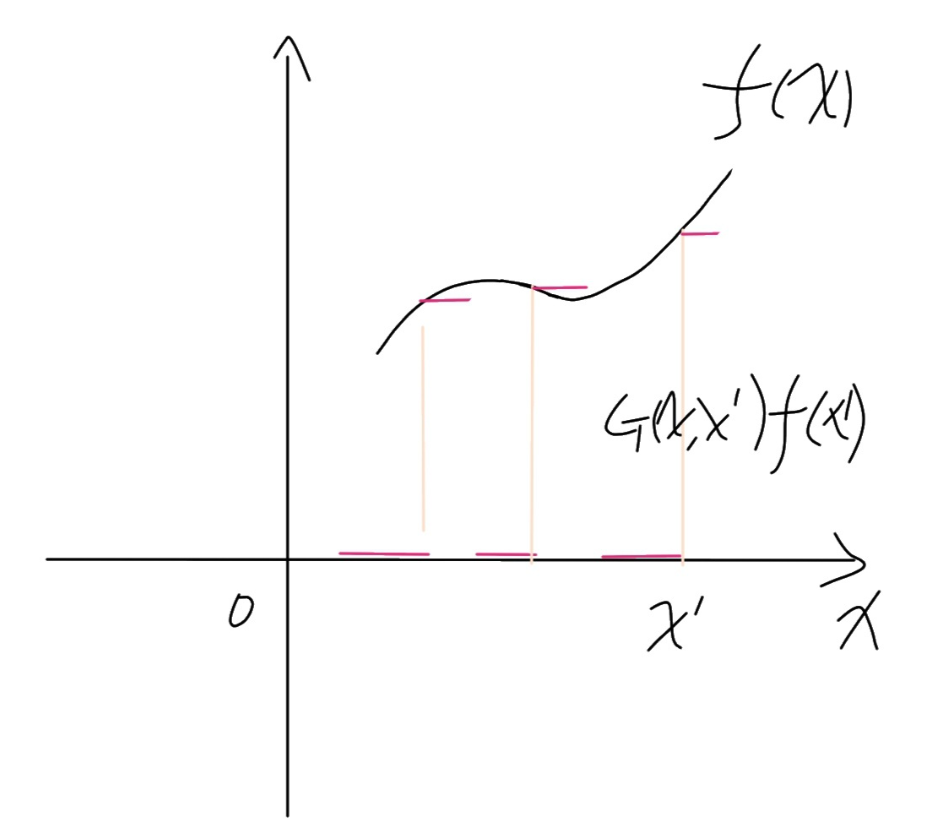
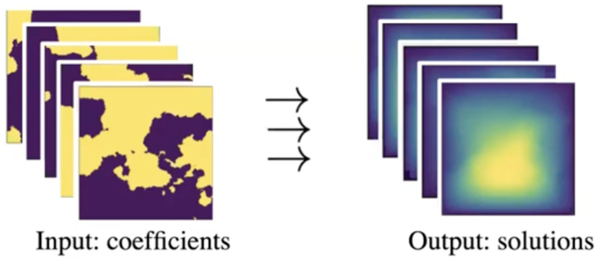

# Projects description

**Purpose:** This is my notes for the Fourier Neural Operator(FNO), both the understanding of paper and code.  

# 1. Introduction

## 1.1 Generally speaking

- FNO is an operator algorithm, you can take a look at the notes of DeepOnet for more details about operator.
- Although it's also data-based algorithm, the generalization of it is very strong as it models the operator instead of the function.
（该算法依然是基于数据的，但是训练好后，因为是对算子进行建模的，而不是对某个函数进行建模的，所以泛化性能强）
- Actually, the core of FNO is use NN to replace the Green function to solve the PDE.

## 1.2 Structure of this note

1. Firstly, the Green function and Dirac function for PDE were introduced, as it's the fundamental of FNO methods.

2. Core of FNO was introduced

3. Code simple was introduced.

# 2. Green function

本笔记中的Green函数是非常简单的，很少数学推导的，旨在理解如何用其表示偏微分方程。

## 2.1 从最简单的格林函数引入


> 最简单的格林函数：如上图的函数就是最简单、直观的格林函数，这个函数也叫【阶跃函数】，在某个点 x' 突然从 0 跳跃到 1 ，从水平地面上升了一个台阶。也可以叫【单位跃迁函数】，或者叫【传播子】，因为可以设想它在 x' 点激发了一个单位的信号(比如概率幅)并传播到后来的 x 处。

作用：格林函数可以作为**用来生成函数的生成元**，或简称为函数的生成元。

原理：任何函数都可以看成不同点的此格林函数的带系数的叠加，即线性叠加。

说明：以最简单的格林函数为例，$G(x,x')$ 是在 $x'$ 点从 0 (横轴)上升到 1 ，那么，想从 0 上升到 $f(x')$ ，只要 $G(x,x')$ 乘以 $f(x')$ 即可，即： $f(x)=G(x,x')f(x')$.



## 2.2 积分、导数

1. 积分：函数 $f(x)$ 对 x 的积分 $u(x)=\int{f(x)}dx$ ，可以转化为 $G(x,x')f(x')$ 对 $x'$ 的积分：

$$u(x)=\int{f(x)}dx=\int{G(x,x')}f(x')dx'\tag{2.1}$$,

2. 导数：
$u(x)$对$x$求导:
$$\frac{∂u(x)}{∂x}=f(x)=\int{\frac{∂G(x,x')}{∂x}f(x')dx'}\tag{2.2}$$,

    此时问题成为对格林函数的导数
    而G(x,x') 对 x 的导函数：狄拉克函数 $\delta(x-x')$，其在 x' 处无穷大，在其它处为0，整个积分为1。


$$\frac{∂u(x)}{∂x}=f(x)=\int{\delta(x-x')f(x')dx'}\tag{2.3}$$,

## 2.3 本质

格林函数G是，某种微分算符L作用于它，会得到狄拉克函数，假如已知这种微分算符L作用于某函数$u(x)$等于$f(x)$，那么，$u(x)$可以用积分求出：

$$u(x)=\int{G(x,x')}f(x')dx'\tag{2.4}$$

当然，x'可以积分换元为y等等，x'仅代表是一个点(即格林函数取值的点)

> 个人理解：
可以将格林函数类比于核函数，通过其离散各个点的微分结果，再积分，得到原函数。
x'是积分微元所在的区域，$G(x,x')$代表在适用于该问题的格林函数，在(x,x')处的值，例如最简单的格林函数中，当$x<x'$时，$G(x,x')=0$。而其后的f(x')则代表u(x)的微分函数f(x')在x'处的结果，将其乘积对整个积分微元积分，即可得到微分函数f(x)的原函数u(x)。

> 例子：假设 x 的定义域是[0,1]，则x=0.5处的解u(0.5)是受x在[0,1]所有点影响的，而这个影响大小取决于 G，比如G(0.5,0)就是x=0这个点对x=0.5的影响，而G(0.5,1)则同理。因为定义域是连续的，所以累加就变成了积分，而x'只是个积分符号而已，就代表格林函数后面的那个点在 D 上积分。

# 3. Neural Operators

算子学习的目标是解决一类问题，获得更好的泛化能力，如果能有一个训练好的算子模型，那么在理想情况下，改变参数、初边界条件或改变强迫项，理论上也应该是适用的。也就是说，算子学习是在学习a family of PDEs。FNO，即结合了傅里叶变换的一种神经算子，在本节主要介绍算子是如何实现的。

## 3.1 算子学习范式

### 3.1.1 问题引入

假设有一个二阶椭圆偏微分方程如下：

$$\begin{aligned} -\nabla \cdot(a(x) \nabla u(x)) &=f(x), & & x \in D \\ u(x) &=0, & & x \in \partial D \end{aligned} \tag{3.1}$$

其中$u(x)$是我们的目标求解对象(微分方程原函数)， $f(x)$ 就是右端项(微分方程)，在很多物理方程中被视为强迫项，而这个 $a(x)$ 是参数， $a \in \mathcal{A}$ ，其中 $\mathcal{A}$ 是参数空间。如果我们把其写成算子的形式，则表达成如下形式：

$$\begin{aligned} \left(\mathcal{L}_{a} u\right)(x) &=f(x), & & x \in D \\ u(x) &=0, & & x \in \partial D \end{aligned} \tag{3.2}$$

其中 $\mathcal{L}_{a} \cdot=-\operatorname{div}(a \nabla \cdot) $，即微分算子，其下标 a 的意思是说在参数 a 时的算子 $\mathcal{L}$

### 3.1.2 格林函数法引入

根据上一节提到的偏微分方程求解析解的方法：**格林函数法**，由式(2.4)，构造一个格林函数 G ，定义域满足 $D \times D \rightarrow \mathbb{R}$ ，使得偏微分方程f(x)的解u(x)可以写为

$$u(x)=\int_{D} G_{a}(x, y) f(y) dy\tag{3.3}$$

推导验证：
此处再次结合微分算子，进行一次推导，由格林函数微分可得 $\mathcal{L}_a G(x, \cdot)=\delta_x$ 其中 $\delta_x$ 被称为狄拉克测度（dirac delta measure），测度这个概念比较抽象，在实数域里就是dirac函数。dirac函数有一个性质，就是和任意函数积分后为函数本身，基于此，可以有推导：

$$\begin{aligned} \left(\mathcal{L}_a u\right)(x) &=\int_{D}\left(\mathcal{L}_a G(x, \cdot)\right)(y) f(y) d y \\ &=\int_D \delta_x(y) f(y) d y \\ &=f(x) \end{aligned} $$
即对u(x)取微分后得到了f(x)。

### 3.1.3 算子替代——FNO结构

基于格林函数法的原理下，设计一个神经网络架构。但由前项推导可得，格林函数法成立的前提是叠加原理，叠加原理的前提是线性微分方程（如果是离散的，即就是对格林函数和偏微分方程进行线性求和，而连续则是积分，即式(2.4)与式(3.3)），而如果想要使其能够解决非线性方程，可以通过神经网络的非线性激活函数。

$$v_{t+1}(x)=\sigma\left(W v_{t}(x)+\int_{D} \kappa_{\phi}(x, y, a(x), a(y)) v_{t}(y) \nu_{x}(d y)\right) \tag{3.4}$$

结构说明：如下图所示是FNO整体结构，首先是图(a)，表示的是这个神经网络结构整体的框架图， $a(x)$ 作为输入，经过 $P$ 这个神经网络映射到高维，然后经历T个Fourier Layer，经过 $Q$ 之后恢复回 $u(x)$ 。图(b)则表达了一个Fourier Layer内部都经历了哪些过程，其中 $v(x)$ 进来以后，经过Fourier变换，将其转化到Fourier空间， $R$ 则是一个线性变换，目的是滤掉高频模态，然后用Fourier逆变换将其转化回源空间， $R$ 之所以不选用神经网络映射作者说是因为实验发现线性效果更好，下面那条支路就类似于ResNet的“短路”结构，相加求和之后，经过激活函数进行非线性映射。


<center style="font-size:14px;color:#C0C0C0;text-decoration:underline">FNO整体结构示意图</center>

经过以上的处理后，即实现了原理与格林函数方法相同，但算子采用傅里叶层进行学习的算子法。傅里叶层具体内容见下节。
而显然可以看到，式(4.3)中对积分的运算是主要难点，而处理积分的算子即是著名的Fourier Neural Operator(FNO)

### 3.1.4 傅里叶层

作者提出了一个可迭代的架构，特别强调一下，此处的下标 t 指的不是时间，而是将神经网络设计成了多层的结构。打个比方，比如设计了4个Fourier层，则分别被t=0到t=3所指代，而每一层都会有类似ResNet的设计，其中 $\sigma$ 是激活函数， $\kappa_{\phi}$ 是神经网络(式3.4)，这个 $v_t(y)$ 如果t=0时可以理解成是格林公式里的 $f(y)$ ，如果是非0的话，就代表对应层的输出。 $\nu_x$是Borel测度，在Lebesgue测度下有 $\nu_{x}(dy)=dy$，在我们应用的绝大多数场景可以无视。


<center style="font-size:14px;color:#C0C0C0;text-decoration:underline">Fourier层示意图(来自Zongyi Li的学术报告Neural Operator for Parametric PDEs)</center>

### 3.1.5 FNO算子
作者Zongyi Li在一次学术报告中说，他的直觉来自Fourier Filter是global的，而如果只使用CNN filter的话，感受是local的。该模型设计还有一个目的，就是要与分辨率无关，而传统的偏微分方程求解方法之一的谱方法也有可借鉴的思路。因为从傅立叶空间中学习参数，相当于将物理空间投影在以 $e^{2 \pi i\langle x, k\rangle}$ 为基的空间下，而这个空间下是处处well-defined，与离散无关。除此之外，使用FFT之后，计算复杂度变成了准线性的，为大规模计算提供了可能。

接下来我们推导下Fourier Operator是如何解决核积分的问题，不妨用 $\mathcal{K}$ 表示核积分算子

$$\left(\mathcal{K}(a ; \phi) v_{t}\right)(x):=\int_{D} \kappa(x, y, a(x), a(y) ; \phi) v_{t}(y) \mathrm{d} y, \quad \forall x \in D\tag{3.5}$$

傅立叶变换的表达式如下

$$(\mathcal{F} f)_{j}(k)=\int_{D} f_{j}(x) e^{-2 i \pi\langle x, k\rangle} \mathrm{d} x, \quad\left(\mathcal{F}^{-1} f\right)_{j}(x)=\int_{D} f_{j}(k) e^{2 i \pi\langle x, k\rangle} \mathrm{d} k \tag{3.6}$$

则可以推出


$$\left(\mathcal{K}(a ; \phi) v_{t}\right)(x)=\mathcal{F}^{-1}\left(\mathcal{F}\left(\kappa_{\phi}\right) \cdot \mathcal{F}\left(v_{t}\right)\right)(x), \quad \forall x \in D\tag{3.7}$$

这样，Fourier积分算子就可以写成

$$\left(\mathcal{K}(\phi) v_{t}\right)(x)=\mathcal{F}^{-1}\left(R_{\phi} \cdot\left(\mathcal{F} v_{t}\right)\right)(x) \quad \forall x \in D\tag{3.8}$$

傅立叶神经算子的提出是解决了算子学习里的积分项，故式3.4变为：

$$v_{t+1}(x):=\sigma\left(W v_{t}(x)+\left(\mathcal{K}(a ; \phi) v_{t}\right)(x)\right), \quad \forall x \in D\tag{3.9}$$

### 3.1.6 总结

以这个方式设计出的神经网络，本质是基于格林函数求解PDE，但与之前格林函数法求解不同的是，该方法使用神经算子替代了构造格林函数，通过傅里叶变化，进行了高频过滤，减小误差的同时，提高了计算速度。

总的来看，该方法可以建立a(x)->u(x)的映射（a(x)是偏微分方程参数，u(x)是偏微分方程的解)。如果训练好这样一个神经网络，成功逼近了a(x)和u(x)的映射关系，那么只需要输入目标参数a即可得到对应条件下的解u，就像上图所表达的一样，时间代价仅仅是神经网络的inference的时间，而不像PINNs类方法需要重新training。

经过作者实验观察，发现这一神经网络架构不仅可以在函数空间中映射参数a和u的关系，也可以用来映射f和u的关系，甚至非零边界条件g和u的关系。如果更general一点，则可以映射(a,f,g)->u的关系。

### 3.1.7 问题

目前仍然有没有非常理解的地方：
1. 傅里叶变换的意义除了：高频滤波降低误差、加快计算（不懂怎么加快的）以外，还有吗？
2. $W$也是由网络学习得到的吗？
3. 与DeepONet的异同？（）

# 4. 案例和代码解读


[代码地址](https://link.zhihu.com/?target=https%3A//github.com/zongyi-li/fourier_neural_operator)

## 4.1 Navier-Stokes Equation

本部分的内容对应于[5]的5.3。

### 4.1.1 公式描述

论文中展示的问题是2D粘性不可压NS方程，且是涡方程。

> 使用涡方程的原因：涡度场通过对x和y求导就可以得到速度场u和v，使用NS方程的涡度形式往往能起到简化作用，比如想要用PINNs模型正向求解NS方程来预测速度场的变化，使用涡度方程作为loss的话神经网络的输出层就需要一个神经元代表w即可，自动微分也只需要对这一个变量进行求导，往往在优化上难度更低。

本地代码位置：`F:\1-infomation\2-学习\自学\人工智能相关\物理相关\FNO\fourier_neural_operator-master\fourier_2d_time.py`

<!-- $$\begin{aligned} \partial_{t} w(x, t)+u(x, t) \cdot \nabla w(x, t) &=\nu \Delta w(x, t)+f(x), & & x \in(0,1)^{2}, t in(0, T] \\ \nabla \cdot u(x, t) &=0, & & x \in(0,1)^{2}, t \in[0, T] \\ w(x, 0) &=w_{0}(x), & & x \in(0,1)^{2} \end{aligned}\\$$ -->
动量方程：
$$\begin{aligned} \partial_{t} w(x, t)+u(x, t) \cdot \nabla w(x, t) &=\nu \Delta w(x, t)+f(x),x \in(0,1)^{2}, t \in (0, T] \end{aligned}\tag{4.1}$$

连续型方程：
$$ \begin{aligned}\nabla \cdot u(x, t) &=0, && x \in(0,1)^{2}, t \in[0, T]\end{aligned}\tag{4.2}$$

周期性条件：

$$ \begin{aligned}w(x, 0) &=w_{0}(x), & & x \in(0,1)^{2} \end{aligned}\tag{4.3}$$

### 4.1.2 具体场景

该场景对FNO模型输入t在$[0,10)$时刻的涡度场变量，其分辨率为$64*64$，输入的变量维度是$[64,64,10]$，希望FNO模型能输出t>10时刻的涡度场的值。也就是说，在该场景下希望FNO模型能通过给定的数据集学习到涡度时间序列的演变关系，实现一个类似时间序列预测的模型。

### 4.1.3 生成数据

本地代码位置：`F\1-infomation\2-学习\自学\人工智能相关\物理相关\FNO\fourier_neural_operator-master\data_generation\navier_stokes\ns_2d.py`

```python

# ns_2d.py 源代码的111行-159行
# 计算的设备
device = torch.device('cuda')
# 所生成数据集的分辨率
s = 256
# 生成多少个解
N = 20
# 初始化一个高斯随机场
# GaussianRF是作者自己写的函数
GRF = GaussianRF(2, s, alpha=2.5, tau=7, device=device)

# 初始化时间t
t = torch.linspace(0, 1, s+1, device=device)
t = t[0:-1]
# 方程中的f(x) = 0.1*(sin(2pi(x+y)) + cos(2pi(x+y)))
X,Y = torch.meshgrid(t, t, indexing='ij')
f = 0.1*(torch.sin(2*math.pi*(X + Y)) + torch.cos(2*math.pi*(X + Y)))

#用于设置ns方程的解具体求多少时间步
record_steps = 200

# a是初始条件，即用GRF生成的n=20个分辨率为[256,256]个初始条件
a = torch.zeros(N, s, s)
# u是NS方程的解，即20个初始条件所对应的空间与时间分辨率为[256,256,200]的解，同时第四个维度记录了各个时间步长下的结果
u = torch.zeros(N, s, s, record_steps)

#Solve equations in batches (order of magnitude speed-up)

#Batch size
bsize = 20

c = 0
t0 =default_timer() # 计时用的时间戳

for j in range(N//bsize):

    # 使用高斯随机场随机生成20个[256,256]初始条件
    w0 = GRF.sample(bsize)

    # 使用本文件定义的navier_stokes_2d函数用传统数值方法求解ns方程
    # 其中w0是前面用高斯随机场生成的20个初始条件，f是方程里f(x)的强迫项，1e-4是粘性系数
    sol, sol_t = navier_stokes_2d(w0, f, 1e-3, 50.0, 1e-4, record_steps)
    # 将GRF生成的20个初始场赋给a，将数值求解的解sol赋给u，sol_t是解对应的时间t
    a[c:(c+bsize),...] = w0
    u[c:(c+bsize),...] = sol

    c += bsize
    t1 = default_timer() # 计时用的时间戳
    print(j, c, t1-t0)
# 将结果存入ns_data.mat文件中，其中a是[20,256,256]，u是[20,256,256,200]，t是[200]，其中[20]是初始条件的个数，即一个案例
scipy.io.savemat('ns_data.mat', mdict={'a': a.cpu().numpy(), 'u': u.cpu().numpy(), 't': sol_t.cpu().numpy()})
```

### 4.1.4 训练网络

了解数据结构后，来看是如何进行训练的

本地代码位置：`F\1-infomation\2-学习\自学\人工智能相关\物理相关\FNO\fourier_neural_operator-master\fourier_2d_time.py`

```python
# fourier_2d_time.py 155-250行
# 读取数据集，其命名方式是V代表粘度系数，N是解的个数，T是时间步
# 对data_generation文件中的对应参数修改即可得到类似的数据集
# github上作者提供了几类数据集和预训练模型的下载
TRAIN_PATH = 'data/ns_data_V100_N1000_T50_1.mat'
TEST_PATH = 'data/ns_data_V100_N1000_T50_2.mat'
# 选取的训练和测试数据集的数量
ntrain = 1000
ntest = 200
# Fourier层中的两个参数，后文讲解
modes = 12
width = 20
# bath_size，注意有两个
batch_size = 20
batch_size2 = batch_size
# 基本的训练参数
epochs = 500
learning_rate = 0.001
# scheduler的参数，用于Optimizer的学习率的自动调整，具体参数后续再学
scheduler_step = 100
scheduler_gamma = 0.5

print(epochs, learning_rate, scheduler_step, scheduler_gamma)
# 设置文件路径
path = 'ns_fourier_2d_rnn_V10000_T20_N'+str(ntrain)+'_ep' + str(epochs) + '_m' + str(modes) + '_w' + str(width)
path_model = 'model/'+path
path_train_err = 'results/'+path+'train.txt'
path_test_err = 'results/'+path+'test.txt'
path_image = 'image/'+path
# sub用于下采样分辨率，比如数据集生成的是256*256，将sub设置为4即可得到64*64，在验证分辨率不变性的实验里用到
sub = 1
# 分辨率设置，该数据集是64*64的
S = 64
# 用于设置FNO输入的时间序列长度，本实验的输入是T在[0,10)时的w
T_in = 10
T = 10
step = 1

################################################################
# load data
################################################################
# 可以看出在该场景下，仅仅用到了数据里的u变量，分别将[0,10)作为输入，[10,20)作为输出的label，a是从0到目前时间步的数据(相当于x)，而u则是当前时间步到下一时间步的数据（相当于y）

reader = MatReader(TRAIN_PATH)
train_a = reader.read_field('u')[:ntrain,::sub,::sub,:T_in]
train_u = reader.read_field('u')[:ntrain,::sub,::sub,T_in:T+T_in]

reader = MatReader(TEST_PATH)
#test是从后取（同一时间切片上）
test_a = reader.read_field('u')[-ntest:,::sub,::sub,:T_in]
test_u = reader.read_field('u')[-ntest:,::sub,::sub,T_in:T+T_in]

print(train_u.shape) #[1000,64,64,10]
print(test_u.shape) #[1000,64,64,10]

#检查数据维度是否正确，如果对不上，则会报错
assert (S == train_u.shape[-2])
assert (T == train_u.shape[-1])

#不理解为什么要多此一举？可能是为了保证数据维度正确？
train_a = train_a.reshape(ntrain,S,S,T_in)
test_a = test_a.reshape(ntest,S,S,T_in)

# 将数据转化为pytorch的dataloader格式
train_loader = torch.utils.data.DataLoader(torch.utils.data.TensorDataset(train_a, train_u), batch_size=batch_size, shuffle=True)
test_loader = torch.utils.data.DataLoader(torch.utils.data.TensorDataset(test_a, test_u), batch_size=batch_size, shuffle=False)

# FNO2d模型的搭建
# modes和width参数是在开头设置的
model = FNO2d(modes, modes, width).cuda()
# model = torch.load('model/ns_fourier_V100_N1000_ep100_m8_w20')
print(count_params(model))

# 优化器、scheduler、Loss的设置
optimizer = Adam(model.parameters(), lr=learning_rate, weight_decay=1e-4)
scheduler = torch.optim.lr_scheduler.StepLR(optimizer, step_size=scheduler_step, gamma=scheduler_gamma)
#what's the LpLoss
myloss = LpLoss(size_average=False)
for ep in range(epochs):
    model.train()
    t1 = default_timer()
    train_l2_step = 0
    train_l2_full = 0
    for xx, yy in train_loader:
        loss = 0
        # xx是input，yy是label，即对应前面的train_a和train_u
        xx = xx.to(device)
        yy = yy.to(device)
        # 这里需要注意的是，对t在[10,20）的输出方式是滚动的
        # 即输入T[0,10)，输出T[10]，得到T[10]后，下一轮输入T[0,11)，输出T[11]
        # 每次只输出一个时间点的结果，输入该时间点之前的所有结果
        for t in range(0, T, step):
            # 具体时间点label的值，该场景下step被设置为1
            y = yy[..., t:t + step]
            # 输入xx得到FNO的输出im
            im = model(xx)
            # loss是累加的，在输出完[10,20）所有结果后再更新参数
            loss += myloss(im.reshape(batch_size, -1), y.reshape(batch_size, -1))
            # 如果t=0则模型输出直接等于pred，如果不为0，则把本次输出和之前的输出拼接起来，即把每个时间点的输出拼起来
            if t == 0:
                pred = im
            else:
                pred = torch.cat((pred, im), -1)
            # 将本次输出的im拼接到xx上，用作下一轮的输入
            xx = torch.cat((xx[..., step:], im), dim=-1)
        # 计算总loss，更新参数
        train_l2_step += loss.item()
        l2_full = myloss(pred.reshape(batch_size, -1), yy.reshape(batch_size, -1))
        train_l2_full += l2_full.item()

        optimizer.zero_grad()
        loss.backward()
        optimizer.step()
```

### 4.1.5 FNO网络模型

本地代码位置：`F\1-infomation\2-学习\自学\人工智能相关\物理相关\FNO\fourier_neural_operator-master\fourier_2d_time.py`


<center style="font-size:14px;color:#C0C0C0;text-decoration:underline">FNO整体结构示意图</center>

```python
# fourier_2d_time.py 70-141行
class FNO2d(nn.Module):
    def __init__(self, modes1, modes2, width):
        #super()子类更好的继承于父类
        super(FNO2d, self).__init__()
        
         """
        The overall network. It contains 4 layers of the Fourier layer.
        1. Lift the input to the desire channel dimension by self.fc0 .
        2. 4 layers of the integral operators u' = (W + K)(u).
            W defined by self.w; K defined by self.conv .
        3. Project from the channel space to the output space by self.fc1 and self.fc2 .
        
        input: the solution of the previous 10 timesteps + 2 locations (u(t-10, x, y), ..., u(t-1, x, y),  x, y)，所以是十二维的？
        input shape: (batchsize, x=64, y=64, c=12)
        output: the solution of the next timestep
        output shape: (batchsize, x=64, y=64, c=1)
        """

        #[问题]：为什么c=12? 在时间问题里，c是什么？如果是时间，则应该是一个变化的量，在训练网格中看到的训练参数modes=12.是否有关联？

        #[回答]：c应该是10步时间+2个坐标信息，但的确应该是

        # output: the solution of the next timestep
        # output shape: (batchsize, x=64, y=64, c=1)
        self.modes1 = modes1 # Fourier Layer所需要的参数
        self.modes2 = modes2 # Fourier Layer所需要的参数
        self.width = width # Fourier Layer所需要的参数

        #[问题]：为什么非周期性域就需要使用padding补全
        self.padding = 2 # pad the domain if input is non-periodic
        
        #fc0层的意义就是将输入的channel映射到指定channel
        #将输入的12个channel映射到想要的channel，这里设置为width个channel，width在刚才介绍的训练过程中有指定

        self.fc0 = nn.Linear(12, self.width) 
        # 对应着上图(a)里的4个Fourier Layer，具体结构下节分析
        self.conv0 = SpectralConv2d_fast(self.width, self.width, self.modes1, self.modes2)
        self.conv1 = SpectralConv2d_fast(self.width, self.width, self.modes1, self.modes2)
        self.conv2 = SpectralConv2d_fast(self.width, self.width, self.modes1, self.modes2)
        self.conv3 = SpectralConv2d_fast(self.width, self.width, self.modes1, self.modes2)
        # 对应着上图(b)里的W，据说是类似于ResNet的shortcut结构
        self.w0 = nn.Conv2d(self.width, self.width, 1)
        self.w1 = nn.Conv2d(self.width, self.width, 1)
        self.w2 = nn.Conv2d(self.width, self.width, 1)
        self.w3 = nn.Conv2d(self.width, self.width, 1)
        # 设置了bn层，但是该代码并没有使用
        self.bn0 = torch.nn.BatchNorm2d(self.width)
        self.bn1 = torch.nn.BatchNorm2d(self.width)
        self.bn2 = torch.nn.BatchNorm2d(self.width)
        self.bn3 = torch.nn.BatchNorm2d(self.width)
        # 全连接层，用于将channel数从width映射到128
        self.fc1 = nn.Linear(self.width, 128)
        # 全连接层，用于将channel数从128映射到1，即得到最终输出的维度
        self.fc2 = nn.Linear(128, 1)

    def forward(self, x):
        # 这部分就是源代码注释里的 10 timesteps + 2 locations，增加两个维度存储位置信息

        #[问题]：没有看懂为什么要对x进行这些处理？为什么要和grid连起来？
        #答案：是为了加上location的信息，grid即location

        #自定义函数，用于生成grid[batch_size,size_x,size_y,2]
        grid = self.get_grid(x.shape, x.device)
        #cat之后，就在补上了grid信息
        x = torch.cat((x, grid), dim=-1)

        #输入第一个全连接层
        x = self.fc0(x)

        #[问题]：为什么要转置？
        #之前的x[batch,x,location_x, location_y]为什么要转置？

        x = x.permute(0, 3, 1, 2)
        # x = F.pad(x, [0,self.padding, 0,self.padding]) # pad the domain if input is non-periodic

        # 经过Fourier Layer 0
        x1 = self.conv0(x)
        x2 = self.w0(x)
        x = x1 + x2
        x = F.gelu(x)

        # 经过Fourier Layer 1
        x1 = self.conv1(x)
        x2 = self.w1(x)
        x = x1 + x2
        x = F.gelu(x)

        # 经过Fourier Layer 2
        x1 = self.conv2(x)
        x2 = self.w2(x)
        x = x1 + x2
        x = F.gelu(x)

        # 经过Fourier Layer 3，注意该层没有使用激活函数
        x1 = self.conv3(x)
        x2 = self.w3(x)
        x = x1 + x2

        # 经过两个全连接层，将channel维度映射到目标输出的维度
        # x = x[..., :-self.padding, :-self.padding] # pad the domain if input is non-periodic

        #对之前进行转置的，再转置回去
        x = x.permute(0, 2, 3, 1)
        x = self.fc1(x)
        x = F.gelu(x)
        x = self.fc2(x)
        return x

    #该函数用于生成grid,其形状为(batch_size,size_x,size_y,2)
    #具体解释可以看./notes/FUnction_getgrid.py
    def get_grid(self, shape, device):
        batchsize, size_x, size_y = shape[0], shape[1], shape[2]
        gridx = torch.tensor(np.linspace(0, 1, size_x), dtype=torch.float)
        gridx = gridx.reshape(1, size_x, 1, 1).repeat([batchsize, 1, size_y, 1])
        gridy = torch.tensor(np.linspace(0, 1, size_y), dtype=torch.float)
        gridy = gridy.reshape(1, 1, size_y, 1).repeat([batchsize, size_x, 1, 1])
        return torch.cat((gridx, gridy), dim=-1).to(device)
```

### 4.1.6 傅里叶层

本地代码位置：`F\1-infomation\2-学习\自学\人工智能相关\物理相关\FNO\fourier_neural_operator-master\fourier_2d_time.py`

对傅里叶变换不是非常熟悉，故理解可能不对

```python
class SpectralConv2d_fast(nn.Module):
    def __init__(self, in_channels, out_channels, modes1, modes2):
        super(SpectralConv2d_fast, self).__init__()

        """
        2D Fourier layer. It does FFT, linear transform, and Inverse FFT.        """
        # width = 20, modes1=12, modes2=12
        # in_channels = out_channels = width =20
        self.in_channels = in_channels
        self.out_channels = out_channels
        self.modes1 = modes1 #Number of Fourier modes to multiply, at most floor(N/2) + 1
        self.modes2 = modes2 #傅里叶模态相乘的数量，最多floor(N/2) + 1

        self.scale = (1 / (in_channels * out_channels)) # 保证scale不变所设置的量
        # 先随机初始化两个parameter，维度为[20,20,12,12]，并乘上缩放因子scale
        self.weights1 = nn.Parameter(self.scale * torch.rand(in_channels, out_channels, self.modes1, self.modes2, dtype=torch.cfloat))
        self.weights2 = nn.Parameter(self.scale * torch.rand(in_channels, out_channels, self.modes1, self.modes2, dtype=torch.cfloat))

    # 定义向量乘的规则，即定义input和weights如何做乘，理解起来略微抽象
    def compl_mul2d(self, input, weights):
        # (batch, in_channel, x,y ), (in_channel, out_channel, x,y) -> (batch, out_channel, x,y)
        # 可以简单理解成前两个维度做向量乘，即(batch, in_channel),(in_channel, out_channel) -> (batch, out_channel）
        # [20,20,12,12] * [20,20,12,12] = [20,20,12,12]
        # 在这里主要是in_channel和out_channel与batch维度都是20，所以理解起来容易混淆
        return torch.einsum("bixy,ioxy->boxy", input, weights)

    def forward(self, x):
        # 最初输入的x的维度为[20,64,64,20]->[bathsize，resolution，resolution，channel by fc0]
        # 经过permute之后，x的维度变成了[20, 20, 64, 64]，即[bathsize，channel by fc0，resolution，resolution]
        batchsize = x.shape[0]
        #Compute Fourier coeffcients up to factor of e^(- something constant)
        # 将x做傅里叶变换，维度变为x_ft[20, 20, 64, 33]，可自行查阅fft算法的原理，网上资料充足在此不赘述
        x_ft = torch.fft.rfft2(x)

        # Multiply relevant Fourier modes
        # 定义out_ft变量用于存储结果，维度为[20, 12, 64, 33]，因为modes设置的是12，因此只有12个channel用于相乘
        out_ft = torch.zeros(batchsize, self.out_channels,  x.size(-2), x.size(-1)//2 + 1, dtype=torch.cfloat, device=x.device)
        # 根据前面的向量乘法定义规则，即(batch, in_channel),(in_channel, out_channel) -> (batch, out_channel）
        # out_ft[0:20,0:12,0:12,0:12] = x_ft[0:20, 0:20, 0:12, 0:12] * weights1[0:20, 0:20, 0:12, 0:12]
        out_ft[:, :, :self.modes1, :self.modes2] = \
            self.compl_mul2d(x_ft[:, :, :self.modes1, :self.modes2], self.weights1)
        # 同理，只不过倒着处理12个模态
        # out_ft[0:20,0:12,-12:end,-12:end] = x_ft[0:20,0:12,-12:end,-12:end] * weights2[0:20, 0:20, 0:12, 0:12]
        out_ft[:, :, -self.modes1:, :self.modes2] = \
            self.compl_mul2d(x_ft[:, :, -self.modes1:, :self.modes2], self.weights2)
        # 经过一波相乘后，out_ft在[0,12]和[-12:end]处有信息，而之外的区间内是0
        # Return to physical space
        # 傅里叶逆变换，将傅里叶空间转换到物理空间
        x = torch.fft.irfft2(out_ft, s=(x.size(-2), x.size(-1)))
        return x
```

### 4.1.7 Pipeline

#### 4.1.7.1 数据准备

- 由自定义的函数产生数据，数据主要是基于前十步的速度场(即下标为a的数据)，重构之后的速度场(即下标为u的数据)

- 通过`MatReader`获取train和test

- 通过`assert()`函数确定形状是否吻合

- 改变数据的形状，改为[ntrain,S,S,T_in]与[ntest,S,S,T_in]

- 输入到`DataLoader`中

#### 4.1.7.2 数据传入网络

- 数据通过`dataLoader`按batch_size输入到模型中，输入的维度为[batch_size,s,s,10]

- 输入模型后，首先进入`forward`，在其中，生成了grid以表示坐标信息，并通过`cat`与原本输入的x连接，此时x的shape[batch_size,s,s,12]

- 网络第一层：`fc0`，linear层，经过该层后，x的shape为[batch_size,s,s,width]，再经过permute转置，形状成为[batch_size,width,s,s]

- 网络第二层~第五层，傅里叶层+ResNet层，并将两层的输出相加(非叠加，进行矩阵加法)，相加后进行`gelu`激活函数，形状变为[batch_size,width,s,s]


## 4.2 Darcy flow

### 4.2.1 公式描述

$$\begin{aligned} -\nabla \cdot(a(x) \nabla u(x)) &=f(x), & & x \in (0,1)^2 \\ u(x) &=0, & & x \in \partial (0,1)^2 \end{aligned} \tag{4.2}$$

公式中$a(x)$ 是扩散系数，$f$是强迫项

### 4.2.2 问题描述

这是一个2-D Darcy flow 的问题，二阶，线性，椭圆PDE问题，期望通过网络实现输入$a(x)$输出$u(x)$。
作者通过两种方式生成了随机的$a(x)$，首先是使用编写的`GRF`函数，产生随机的分布，再通过两种方式，一种是转为thresh的(图1)，一种是转为对数的(图2)，如下图所示：


### 4.2.3 数据生成

代码位置：`F\1-infomation\2-学习\自学\人工智能相关\物理相关\FNO\fourier_neural_operator-master\data_generation\darcy\demo.m`
作者是用MATLAB写的数据生成，我有自己写的Python版本
```MATLAB
%Number of grid points on [0,1]^2 
%i.e. uniform mesh with step h=1/(s-1)
%分辨率
s = 256;

%Create mesh (only needed for plotting)
[X,Y] = meshgrid(0:(1/(s-1)):1);

%Parameters of covariance C = tau^(2*alpha-2)*(-Laplacian + tau^2 I)^(-alpha)
%Note that we need alpha > d/2 (here d= 2) 
%Laplacian has zero Neumann boundry
%alpha and tau control smoothness; the bigger they are, the smoother the
%function
alpha = 2;
tau = 3;

%Generate random coefficients from N(0,C)
norm_a = GRF(alpha, tau, s);

%Exponentiate it, so that a(x) > 0
%Now a ~ Lognormal(0, C)
%This is done so that the PDE is elliptic
lognorm_a = exp(norm_a);

%Another way to achieve ellipticity is to threshhold the coefficients
thresh_a = zeros(s,s);
thresh_a(norm_a >= 0) = 12;
thresh_a(norm_a < 0) = 4;

%Forcing function, f(x) = 1 
f = ones(s,s);

%Solve PDE: - div(a(x)*grad(p(x))) = f(x)
lognorm_p = solve_gwf(lognorm_a,f);
thresh_p = solve_gwf(thresh_a,f);

%Plot coefficients and solutions
subplot(2,2,1)
surf(X,Y,lognorm_a); 
view(2); 
shading interp;
colorbar;
subplot(2,2,2)
surf(X,Y,lognorm_p); 
view(2); 
shading interp;
colorbar;
subplot(2,2,3)
surf(X,Y,thresh_a); 
view(2); 
shading interp;
colorbar;
subplot(2,2,4)
surf(X,Y,thresh_p); 
view(2); 
shading interp;
colorbar;

```

### 4.2.4 训练

```python
TRAIN_PATH = 'data/Darcy_241/piececonst_r241_N1024_smooth1.mat'
TEST_PATH = 'data/Darcy_241/piececonst_r241_N1024_smooth2.mat'
#与4.1.3 类似
ntrain = 1000
ntest = 100

batch_size = 20
learning_rate = 0.001

epochs = 5
step_size = 100
gamma = 0.5

modes = 12
width = 32

#用于调整分辨率，例如本问题，就将分辨率降为了49*49
r = 5
h = int(((241 - 1)/r) + 1)
s = h

#读取数据
reader = MatReader(TRAIN_PATH)
#处理后x_train.shape:[1000,49,49]
x_train = reader.read_field('coeff')[:ntrain,::r,::r][:,:s,:s]
y_train = reader.read_field('sol')[:ntrain,::r,::r][:,:s,:s]

#处理后x_test.shape:[100,49,49]
reader.load_file(TEST_PATH)
x_test = reader.read_field('coeff')[:ntest,::r,::r][:,:s,:s]
y_test = reader.read_field('sol')[:ntest,::r,::r][:,:s,:s]

#这是作者自己写的normalization，在utilities3.py
x_normalizer = UnitGaussianNormalizer(x_train)
x_train = x_normalizer.encode(x_train)
x_test = x_normalizer.encode(x_test)
y_normalizer = UnitGaussianNormalizer(y_train)
y_train = y_normalizer.encode(y_train)
#注意，这里并没有对y_test 做任何处理

#补充了第四个维度，为1

x_train = x_train.reshape(ntrain,s,s,1)
x_test = x_test.reshape(ntest,s,s,1)

#dataloader
train_loader = torch.utils.data.DataLoader(torch.utils.data.TensorDataset(x_train, y_train), batch_size=batch_size, shuffle=True)
test_loader = torch.utils.data.DataLoader(torch.utils.data.TensorDataset(x_test, y_test), batch_size=batch_size, shuffle=False)


model = FNO2d(modes, modes, width).cuda()
print(count_params(model))
#设置optimizer
optimizer = Adam(model.parameters(), lr=learning_rate, weight_decay=1e-4)
scheduler = torch.optim.lr_scheduler.StepLR(optimizer, step_size=step_size, gamma=gamma)

myloss = LpLoss(size_average=False)
y_normalizer.cuda()
#开始训练
for ep in range(epochs):
    model.train()
    t1 = default_timer()#记时用的时间戳
    train_l2 = 0
    #x,y即x_train和y_train
    for x, y in train_loader:
        x, y = x.cuda(), y.cuda()

        optimizer.zero_grad()
        out = model(x).reshape(batch_size, s, s)
        out = y_normalizer.decode(out)
        y = y_normalizer.decode(y)

        loss = myloss(out.view(batch_size,-1), y.view(batch_size,-1))
        loss.backward()

        optimizer.step()
        train_l2 += loss.item()

    scheduler.step()

    model.eval()
    test_l2 = 0.0
    with torch.no_grad():
        for x, y in test_loader:
            x, y = x.cuda(), y.cuda()

            out = model(x).reshape(batch_size, s, s)
            out = y_normalizer.decode(out)

            test_l2 += myloss(out.view(batch_size,-1), y.view(batch_size,-1)).item()

    train_l2/= ntrain
    test_l2 /= ntest

    t2 = default_timer()
    print(ep, t2-t1, train_l2, test_l2)
```

### 4.2.4 FNO网络结构

代码位置：`F\1-infomation\2-学习\自学\人工智能相关\物理相关\FNO\fourier_neural_operator-master\fourier_2d.py`

该部分代码和4.1.5介绍的基本雷同，除了channel不同
```python
class FNO2d(nn.Module):
    def __init__(self, modes1, modes2,  width):
        super(FNO2d, self).__init__()

        """
        The overall network. It contains 4 layers of the Fourier layer.
        1. Lift the input to the desire channel dimension by self.fc0 .
        2. 4 layers of the integral operators u' = (W + K)(u).
            W defined by self.w; K defined by self.conv .
        3. Project from the channel space to the output space by self.fc1 and self.fc2 .
        
        input: the solution of the coefficient function and locations (a(x, y), x, y), 所以是三维的
        input shape: (batchsize, x=s, y=s, c=3)
        output: the solution 
        output shape: (batchsize, x=s, y=s, c=1)
        """

        self.modes1 = modes1
        self.modes2 = modes2
        self.width = width
        self.padding = 9 # pad the domain if input is non-periodic
        #此时x_train.shape是[batch_size,s,s,3]
        self.fc0 = nn.Linear(3, self.width) # input channel is 3: (a(x, y), x, y)
        #此时x_train.shape是[batch_size,s,s,width]

        self.conv0 = SpectralConv2d(self.width, self.width, self.modes1, self.modes2)
        self.conv1 = SpectralConv2d(self.width, self.width, self.modes1, self.modes2)
        self.conv2 = SpectralConv2d(self.width, self.width, self.modes1, self.modes2)
        self.conv3 = SpectralConv2d(self.width, self.width, self.modes1, self.modes2)
        self.w0 = nn.Conv2d(self.width, self.width, 1)
        self.w1 = nn.Conv2d(self.width, self.width, 1)
        self.w2 = nn.Conv2d(self.width, self.width, 1)
        self.w3 = nn.Conv2d(self.width, self.width, 1)

        self.fc1 = nn.Linear(self.width, 128)
        self.fc2 = nn.Linear(128, 1)

    def forward(self, x):
        grid = self.get_grid(x.shape, x.device)
        x = torch.cat((x, grid), dim=-1)
        x = self.fc0(x)
        x = x.permute(0, 3, 1, 2)
        x = F.pad(x, [0,self.padding, 0,self.padding])

        x1 = self.conv0(x)
        x2 = self.w0(x)
        x = x1 + x2
        x = F.gelu(x)

        x1 = self.conv1(x)
        x2 = self.w1(x)
        x = x1 + x2
        x = F.gelu(x)

        x1 = self.conv2(x)
        x2 = self.w2(x)
        x = x1 + x2
        x = F.gelu(x)

        x1 = self.conv3(x)
        x2 = self.w3(x)
        x = x1 + x2

        x = x[..., :-self.padding, :-self.padding]
        x = x.permute(0, 2, 3, 1)
        x = self.fc1(x)
        x = F.gelu(x)
        x = self.fc2(x)
        return x
    
    def get_grid(self, shape, device):
        batchsize, size_x, size_y = shape[0], shape[1], shape[2]
        gridx = torch.tensor(np.linspace(0, 1, size_x), dtype=torch.float)
        gridx = gridx.reshape(1, size_x, 1, 1).repeat([batchsize, 1, size_y, 1])
        gridy = torch.tensor(np.linspace(0, 1, size_y), dtype=torch.float)
        gridy = gridy.reshape(1, 1, size_y, 1).repeat([batchsize, size_x, 1, 1])
        return torch.cat((gridx, gridy), dim=-1).to(device)

```

### 4.2.6 傅里叶层

本地代码：`F\1-infomation\2-学习\自学\人工智能相关\物理相关\FNO\fourier_neural_operator-master\fourier_2d.py`

```python
#modes取12的原因是其为分辨率的倍数，例如案例中的（49-1），用于傅里叶层前向传播的参数
class SpectralConv2d(nn.Module):
    def __init__(self, in_channels, out_channels, modes1, modes2):
        super(SpectralConv2d, self).__init__()

        """
        2D Fourier layer. It does FFT, linear transform, and Inverse FFT.    
        """

        self.in_channels = in_channels
        self.out_channels = out_channels
        self.modes1 = modes1 #Number of Fourier modes to multiply, at most floor(N/2) + 1
        self.modes2 = modes2

        self.scale = (1 / (in_channels * out_channels))
        self.weights1 = nn.Parameter(self.scale * torch.rand(in_channels, out_channels, self.modes1, self.modes2, dtype=torch.cfloat))
        self.weights2 = nn.Parameter(self.scale * torch.rand(in_channels, out_channels, self.modes1, self.modes2, dtype=torch.cfloat))

    # Complex multiplication
    def compl_mul2d(self, input, weights):
        # (batch, in_channel, x,y ), (in_channel, out_channel, x,y) -> (batch, out_channel, x,y)
        return torch.einsum("bixy,ioxy->boxy", input, weights)

    def forward(self, x):
        batchsize = x.shape[0]
        #Compute Fourier coeffcients up to factor of e^(- something constant)
        x_ft = torch.fft.rfft2(x)

        # Multiply relevant Fourier modes
        out_ft = torch.zeros(batchsize, self.out_channels,  x.size(-2), x.size(-1)//2 + 1, dtype=torch.cfloat, device=x.device)
        out_ft[:, :, :self.modes1, :self.modes2] = \
            self.compl_mul2d(x_ft[:, :, :self.modes1, :self.modes2], self.weights1)
        out_ft[:, :, -self.modes1:, :self.modes2] = \
            self.compl_mul2d(x_ft[:, :, -self.modes1:, :self.modes2], self.weights2)

        #Return to physical space
        x = torch.fft.irfft2(out_ft, s=(x.size(-2), x.size(-1)))
        return x
```


### 4.2.7 Pipeline

#### 4.2.7.1 数据准备

- 产生数据，数据主要是通过两种方式（thresh和log）产生的不同的a(x)以及对应的u(x)

- 通过`MatReader`获取train和test

- 通过`UniGaussianNormalizer`将x_train, x_test, y_train进行正则化（coder()）

- 经过处理的数据，最终尺寸为x_train:[ntrain,s,s,1],x_test:[ntest,s,s,1]

- 输入到`DataLoader`中

#### 4.2.7.2 数据传入网络

- 数据通过`dataLoader`按batch_size输入到模型中，输入的维度为[batch_size,s,s,1]

- 输入模型后，首先进入`forward`，在其中，生成了grid以表示坐标信息，并通过`cat`与原本输入的x连接，此时x的shape[batch_size,s,s,3]

[问题]：各个网络层的输入、输出是第几维的，为什么[5,2,3,3]输入linear层([5,32])，会成为[5,2,3,32]，其他层是怎么样的？
全连接层，会把前面所有的当做batch_size，只改变最后一维形状

- 网络第一层，全连接层：`fc0`，经过该层后，x的shape为[batch_size,s,s,width]，再经过permute转置，形状成为[batch_size,width,s,s]

- 网络第二层~第五层，傅里叶层+ResNet层，并将两层的输出相加(非叠加，进行矩阵加法)，相加后进行`gelu`激活函数，形状变为[batch_size,width,s+padding,s+padding]

[问题]：这里为什么要多加一个padding维度

- 对最后一层傅里叶层输出进行处理，先将多出来的padding维度舍去`x[..., :-self.padding, :-self.padding]`形状变为[batch_size,width,s,s],在对其进行转置，使得其形状变为[batch_size,s,s,width]

- 网络第六~七层，Linear层 `fc1`,`fc2`，经过`fc1`后形状成为[batch_size,s,s,128]，经过`fc2`后形状变为[batch_size,s,s,1]，即变回了开始的输入的形状

#### 4.2.7.3 训练与评估

- 确定模型 `FNO2d`

- 指定`optimizer=Adam()`与`scheduler=StepLR()` 以及`Loss`，注意Adam和Loss是作者自己写的

- 在每个`epochs`里，首先指定是要进行`train()`，从`train_loader`中读取数据，随后从模型获得输出`out`，并改为[batch_size,s,s]，再输入到`normalizer`中解码，得到模型最终输出`out`

- 根据`out`和解码后的test_y，得到loss,基于loss进行反向传播，调参，注意最终的loss是一个累加结果

- 根据scheduler的设置，进行学习率调整，详细内容可以参考笔记`Torch101.md`

- 调参后在测试集上进行`eval()`，该处与训练雷同

# Refference

1. [AI与PDE:FNO与算子学习的范式](https://zhuanlan.zhihu.com/p/520487599)
2. [偏微分方程(四)——格林函数(Green's function)](https://zhuanlan.zhihu.com/p/394104835)
2. [格林函数解非齐次微分方程](https://zhuanlan.zhihu.com/p/407047845)
4. [什么是格林函数？](https://zhuanlan.zhihu.com/p/371683292)


