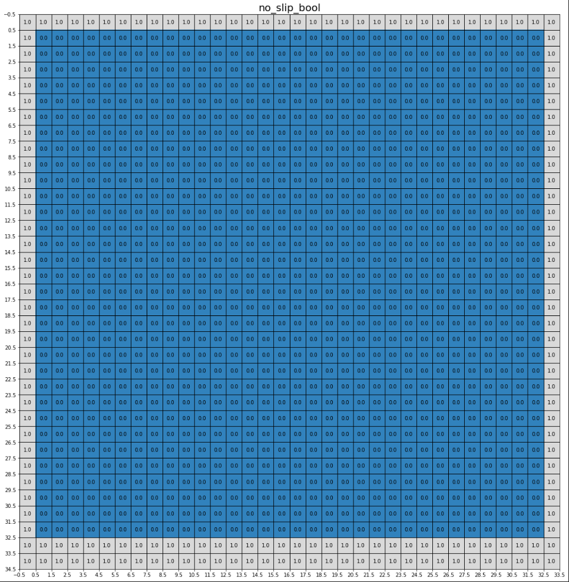

<!-- Author: Howw -->
<!-- Data: 22.8.30 -->

# Description

This is my notes for `PISO` solver with cavity case, which is for simulation the incompressible fluid with FDM, and accelerated by `CUDA`. Original version is written by Dr Bjorn List from Prof. Nils' group[1], respect to him for his work and the spirit of open-source.

In this note, I will introduce the `cavity` case in Chinese. This is a very basic case for fluid simulation and a good starting point of learning `PISO`. 
<!-- Generally speaking, FVM discretizes the partial differential equations with finite volume in tiny girds. The conservation equations are derived in each volume, so the variables are naturally conserved in each volume. The variables change in time and space, and be calculated with the flux in each face of a volume. While the flux in each face is reconstructed using the variables stored in each grid. -->

**Reference:**
[1][URL](https://github.com/tum-pbs/differentiable-piso)

## 导入必要的模块。
```python
import sys
import os
sys.path.append('..')
from diffpiso import *
```

## 设置模拟结果存储目录、雷诺数和网格数量。
```python
simulation_data_directory = '/lidDrivenCavity/'  #"SPECIFY YOUR TARGET DIRECTORY"

RE = 1000
N = 256
```

## 定义压力求解器和线性求解器
`PisoPressureSolverCudaCustom`：

```python
pressure_solver = PisoPressureSolverCudaCustom(accuracy=1e-8, max_iterations=1000, dx=[], cast_to_double=True)
pressure_solver.laplace_rank_deficient = tf.constant(True, dtype=tf.bool, shape=[1, ])
accuracy_placeholder = tf.placeholder(dtype=tf.float32)
linear_solver = LinearSolverCudaMultiBicgstabILU(accuracy=accuracy_placeholder, max_iterations=100, cast_to_double=False)
```

## 设置边界条件

### 设置模拟域

在设置物理参数`SimulationParameters`之前，需要指定边界条件，以及粘度、数值求解器等。

- `dirichlet_mask`: staggered shape，bool类型，用于指定是否为dirichlet边界条件
- `dirichlet_values`: 用于指定边界条件的值，和`dirichlet_mask`配合使用，`dirichlet_mask`为true地方即需要指定具体数值。
- `active_mask`: centered shape padded by 1, `float32`。用于定义流体域的边界条件，即指定哪些区域是有流体存在的，哪些区域是没有流体的。在这里，1.0表示该单元格在计算域内，0.0表示该单元格在计算域外。例如： 0.0则在Dirichlet或者Neumann边界之外; 1.0 则是周期边界之外。
- `accessible_mask`: centered shape padded by 1, `float32`。用于定义流体的实体部分，即指定哪些单元格属于流体，哪些单元格不属于流体。在这里，1.0表示该单元格是流体的一部分，0.0表示该单元格不是流体的一部分。例如： 0.0则在Dirichlet边界之外; 1.0 则是周期或者Neumann边界之外。
- `no_slip_mask`: staggered shape, `bool`。用于定义无滑移壁面的位置，即指定哪些单元格是与无滑移壁面相邻接的单元格。在这里，True表示该单元格是壁面上的速度单元格。注意，壁面也必须在 `active_mask` (在其内部为1，壁面为0)，`accessible_mask`(内部为1，壁面为0)，和`dirichlet_mask`(法向分量为True) 中被编码。
- `bool_periodic`: shape=(2), `bool`: (y,x)。用于指定流体域是否具有周期性边界条件。如果流体域在某个方向上是周期性的，那么在该方向上的边界将被视为相邻边界。

- `viscosity`: 动力粘度（kinematic viscosity），用于描述流体的粘性特性。
- `linear_solver`: 用于解决由对流-扩散方程产生的线性求解器, 推荐: `LinearSolverCudaMultiBicgstabILU`
- `pressure_solver`: 用于解决由压力修正产生的线性求解器, 推荐: `PisoPressureSolverCudaCustom`

使用到的一些函数/类的解释：

- `Domain`: Phiflow的类，用于指定大小和边界条件，具体看Domain类()的代码解释。
- `calculate_staggered_shape`: 计算的是交错网格的形状，它接受一个表示网格大小的元组作为输入，并返回一个表示网格形状的元组。交错网格是指每个网格单元都位于相邻单元的边界上，用于解决压力振荡的问题。（接受两个参数 `batch_size` 和 `resolution`，创建一个具有特定形状的张量 `(batch_size, resolution[0]+1, resolution[1]+1, ..., resolution[n]+1, n+1)`，`n` 是 `resolution` 的长度）
- `calculate_centered_shape`计算的是中心对称网格的形状，它接受一个表示网格大小的元组作为输入，并返回一个表示网格形状的元组。中心对称网格是指每个网格单元都位于中心点上，因此每个单元的边界都与相邻单元的边界重叠。（该函数接受两个参数 `batch_size` 和 `resolution`，创建一个具有特定形状的张量，该张量在每个维度上都不增加大小的）


>**流体域**
>- 当N=10时，以上代码会生成一个二维流体域，大小为11x10，其中x方向的网格数为11，y方向的网格数为10。之所以要形成`[N+1,N]`的流体域是为了确保涵盖所有N个元素，并且可以避免索引错误。这个流体域中使用staggered网格和centered网格来分别表示速度和压力变量。staggered网格的网格点位置比centered网格的网格点位置多一个半步长，因此需要使用`[N+1,N]`的流体域来确保在staggered网格上涵盖所有N个元素。此外，使用`[N+1,N]`的流体域还可以确保在边界处正确地处理边界条件。
>- 这个流体域使用了`staggered grid`（交错网格）的方式来离散化流体模拟方程。在 `staggered grid` 中，速度和压力是在不同的网格点上定义的。这里使用了两个不同的网格：`staggered grid`和`centered grid`。
>- 其中`calculate_staggered_shape`和`calculate_centered_shape`函数分别计算了速度和压力的离散化位置。其中，`staggered_shape`表示速度的离散化位置，`centered_shape`表示压力的离散化位置。

>**边界条件**
>`periodic_bool = (False, False)`创建一个布尔类型的周期性边界条件，其中x和y方向都是非周期性的。
>- 创建一个表示Dirichlet边界条件的掩码，其中y方向上的边界值被设置为1，x方向上的左右两个边界值也被设置为1。即上边界和左右边界的值需要指定。这是通过 `dirichlet_mask_y` 和 `dirichlet_values_y` 来实现的。
>- 创建一个表示Dirichlet边界条件的值，其中x方向上的右边界值被设置为1，即出口速度为1（存疑）。
>- 创建一个表示流体可计算的区域的掩码，其中所有的网格点都被标记为可达。`accessible_mask`用于标记流体域中哪些网格可以被访问，`active_mask`用于标记哪些网格是活跃的。在这里，将`accessible_mask[0,-2,...]`和`active_mask[0,-2,...]`的值赋为0，是为了将最后一行网格的可达性和活跃性设置为0，从而将其排除在算法的计算范围之外。这样做的原因是因为在计算网格的邻居时，最后一行像素点的邻居会超出计算域的边界，因此需要将其排除在计算范围之外，以避免出现错误。
>- 创建一个布尔类型的no-slip边界条件，其中上下左右四个边界都被设置为1，表示速度在边界处为0。`no_slip_bool`用于标记在计算流体运动时哪些位置是壁面，哪些位置不是。`no_slip_bool`数组的形状是`[1, staggered_shape[1]+1, staggered_shape[2]+1, 1]`，其中第一个维度是1，表示只有一个时间步长。第二个和第三个维度的长度分别为`staggered_shape[1]+1`和`staggered_shape[2]+1`，表示在x和y方向上，网格数量加上了1个。这是因为在模拟中，使用的是staggered grid（交错网格）来描述流体的运动，这种网格的特点是在x和y方向上的网格节点是错开的，因此需要在x和y方向上增加一个网格节点。`no_slip_bool`数组中的特定位置元素的值赋为1，表示这些位置是壁面。具体来说，`no_slip_bool[0,0,:,0] = 1`表示将y方向上的第一个节点标记为壁面；`no_slip_bool[0,-2:,:,0] = 1`表示将y方向上的最后两个节点标记为壁面；`no_slip_bool[0,:,0,0] = 1`表示将x方向上的第一个节点标记为壁面；`no_slip_bool[0,:,-1,0] = 1`表示将x方向上的最后一个节点标记为壁面。

因此，这段代码中标记的位置并不是所有的边界，只是标记了在staggered grid中的一些特定位置。在流体模拟中，通常会将壁面的位置标记出来，并将其作为边界条件进行处理，以保证流体在壁面处的运动符合物理规律。

```python
domain = Domain([N+1, N], box=box[0:1+1/N,0:1], boundaries=OPEN)
staggered_shape = calculate_staggered_shape(1, domain.resolution)
centered_shape = calculate_centered_shape(1, domain.resolution)

periodic_bool = (False, False)
dirichlet_mask_y = math.zeros(staggered_shape - np.array([0, 0, 1, 1]))
dirichlet_mask_y[:,0,...] = 1
dirichlet_mask_y[:,-2:,...] = 1
dirichlet_mask_x = math.zeros(staggered_shape - np.array([0, 1, 0, 1]))
dirichlet_mask_x[...,0,:] = 1
dirichlet_mask_x[...,-1,:] = 1
dirichlet_mask_x[:,-1,...] = 1
dirichlet_mask = stack_staggered_components([dirichlet_mask_y, dirichlet_mask_x])
dirichlet_values_y =math.zeros(staggered_shape - np.array([0, 0, 1, 1]))
dirichlet_values_x = math.zeros(staggered_shape - np.array([0, 1, 0, 1]))
dirichlet_values_x[:,-1,...]=1
dirichlet_values = stack_staggered_components([dirichlet_values_y, dirichlet_values_x])

accessible_mask = math.pad(math.ones(staggered_shape + np.array([0, -1, -1, -1])),(0,1,1,0),"constant")
accessible_mask[0,-2,...] = 0
active_mask = math.pad(math.ones(staggered_shape + np.array([0, -1, -1, -1])),(0,1,1,0),"constant")
active_mask[0,-2,...] = 0

no_slip_bool = np.zeros([1,staggered_shape[1]+1, staggered_shape[2]+1,1], dtype=np.bool)
no_slip_bool[0,0,:,0] = 1
no_slip_bool[0,-2:,:,0] = 1
no_slip_bool[0,:,0,0] = 1
no_slip_bool[0,:,-1,0] = 1
no_slip_bool = math.flatten(no_slip_bool)
```

本文以$32 \times 32 $为例，说明边界条件。


<div align=center>
<b>Figure 1</b> 可访问区域掩码示意图
</div>


<div align=center>
<b>Figure 2</b> 计算区域掩码示意图
</div>


<div align=center>
<b>Figure 3</b> 无滑移边界条件（墙）示意图
</div>


<div align=center>
<b>Figure 4</b> 狄利克雷边界条件（x方向）
</div>

显然，该求解中，位移的板是在x的最下方，其速度为1,。


### 设置模拟物理参数。

```python
sim_physics = SimulationParameters(dirichlet_mask=dirichlet_mask.astype(bool), dirichlet_values=dirichlet_values, active_mask= active_mask,
                                   accessible_mask= accessible_mask, bool_periodic= periodic_bool, no_slip_mask=no_slip_bool,
                                   viscosity=1/RE, linear_solver=linear_solver, pressure_solver=pressure_solver)
```

## 设置初始条件

### 定义速度和压力场的占位符和初始值

1. `dt = 0.01`：定义了时间步长。

2. `velocity_placeholder = placeholder(shape=staggered_shape, dtype=tf.float32,basename='velocity_placeholder')`：定义了一个占位符，用于表示速度场，`staggered_shape` 是速度场的形状。

3. `velocity = StaggeredGrid.sample(velocity_placeholder,domain=domain)`：使用`StaggeredGrid`类从 `velocity_placeholder`中采样出速度场数据，并将其存储在`velocity `变量中。`domain`上文介绍过。

4. `pressure_placeholder = placeholder(shape=centered_shape, dtype=tf.float32, basename='pressure_placeholder')`：定义了一个占位符，用于表示压力场，`centered_shape` 是压力场的形状。

5. `pressure = CenteredGrid(pressure_placeholder, box=domain.box, extrapolation=pressure_extrapolation(domain.boundaries))`：使用 `StaggeredGrid` 类从 `velocity_placeholder` 中采样出速度场数据，并将其存储在 `velocity` 变量中。`domain.box` 表示压力场所在的区域，`pressure_extrapolation(domain.boundaries)` 表示压力场的外推方式。

6. `pressure_inc1 = CenteredGrid(tf.zeros_like(pressure.data), pressure.box, pressure.extrapolation)`：定义了一个初始化为全零，用于存储压力场的增量。

7. `pressure_inc2 = CenteredGrid(tf.zeros_like(pressure.data) + 1e-12, pressure.box, pressure.extrapolation)`：定义了一个压力场增量对象，初始化为一个很小的值，不同之处在于这个矩阵的元素全部为 $10^{−12}$，用于避免除以零的情况。

8. `vel_piso, p_piso,_ = piso_step(velocity, pressure, pressure_inc1, pressure_inc2, dt, sim_physics, sim_physics.dirichlet_values)`：此处可以理解为将vel_piso和p_new`piso_step`定义的计算图耦合起来，之后在sess中可以调用该计算图进行计算。

9. `pnew = p_piso.data`：将压力场对象转换为压力场数据。

10. `velnew = vel_piso.staggered_tensor()`：将更新后的速度场对象转换为速度场数据，并转换为tensor对象。

11. `vel_np = StaggeredGrid(np.zeros(staggered_shape), velocity.box)`：使用 `StaggeredGrid` 类创建一个与 `velocity` 相同形状的零矩阵，用于存储更新后的速度场。

12. `p_np = CenteredGrid(np.zeros(pressure.data.shape), pressure.box)`：使用 `CenteredGrid` 类创建一个与 `pressure` 相同形状的零矩阵，用于存储更新后的压力场。

```python
dt = 0.01
velocity_placeholder = placeholder(shape=staggered_shape, dtype=tf.float32,basename='velocity_placeholder')
velocity = StaggeredGrid.sample(velocity_placeholder,domain=domain)

pressure_placeholder = placeholder(shape=centered_shape, dtype=tf.float32, basename='pressure_placeholder')
pressure = CenteredGrid(pressure_placeholder, box=domain.box, extrapolation=pressure_extrapolation(domain.boundaries))
pressure_inc1 = CenteredGrid(tf.zeros_like(pressure.data), pressure.box, pressure.extrapolation)
pressure_inc2 = CenteredGrid(tf.zeros_like(pressure.data) + 1e-12, pressure.box, pressure.extrapolation)
vel_piso, p_piso,_ = piso_step(velocity, pressure, pressure_inc1, pressure_inc2, dt, sim_physics, sim_physics.dirichlet_values)
pnew = p_piso.data
velnew = vel_piso.staggered_tensor()
vel_np = StaggeredGrid(np.zeros(staggered_shape), velocity.box)
p_np = CenteredGrid(np.zeros(pressure.data.shape), pressure.box)
```

### 在时间步长内循环，调用 PISO 算法求解速度和压力场

这段代码的作用是使用 TensorFlow 进行流体模拟计算。具体解释如下：

1. `np_accuracy=1e-3`：设置精度为 0.001，用于控制模拟的精度。
2. `save_path = create_base_dir(simulation_data_directory,'LDC_Re'+str(RE)+'_'+str(N)+'x'+str(N)+'_')`：创建一个文件夹，用于存储模拟数据。`simulation_data_directory` 是指定的模拟数据的根目录，`RE` 和 `N` 分别是雷诺数和网格大小，用于在文件夹名称中标识模拟的参数。
3. `print(save_path)`：打印保存路径。
4. `session_config = tf.ConfigProto()`：创建 TensorFlow 的会话配置。
5. `session_config.gpu_options.allow_growth = True`：设置 GPU 内存按需分配，以避免内存不足的问题。
6. `sess = tf.Session(config=session_config)`：创建 TensorFlow 会话。
7. `for i in range(int(25 // dt)):`：进行模拟计算，`dt` 是时间步长，`25` 是模拟最终时间。
8. `feed_dict = {velocity_placeholder: vel_np.staggered_tensor(), pressure_placeholder: p_np.data, accuracy_placeholder: np_accuracy}`：创建一个字典，用于将输入数据传递给 TensorFlow 模型。`velocity_placeholder`、`pressure_placeholder` 和 `accuracy_placeholder` 是 TensorFlow 的占位符，用于接收输入数据。`vel_np` 和 `p_np` 是当前的速度和压力场，用于更新模拟。

9. `vel_out, p_out = sess.run([velnew, pnew], feed_dict=feed_dict)`：运行 TensorFlow 模型，得到新的速度和压力场。

10. `vel_np = StaggeredGrid(vel_out, velocity.box)`：将新的速度场转换为 `StaggeredGrid` 对象，以便进行下一步计算。

11. `p_np = CenteredGrid(p_out, pressure.box)`：将新的压力场转换为 `CenteredGrid` 对象，以便进行下一步计算。

```python
np_accuracy=1e-3
save_path = create_base_dir(simulation_data_directory,'LDC_Re'+str(RE)+'_'+str(N)+'x'+str(N)+'_')
print(save_path)
session_config = tf.ConfigProto()
session_config.gpu_options.allow_growth = True
sess = tf.Session(config=session_config)
for i in range(int(25 // dt)):
    feed_dict = {velocity_placeholder: vel_np.staggered_tensor(),
                 pressure_placeholder: p_np.data,
                 accuracy_placeholder: np_accuracy}

    vel_out, p_out = sess.run([velnew, pnew], feed_dict=feed_dict)
    vel_np = StaggeredGrid(vel_out, velocity.box)
    p_np = CenteredGrid(p_out, pressure.box)
```

如图是输入计算图后，前几步的结果。


<div align=center>
<b>Figure 5</b> 输入计算图后，压力场示意图，注意，虽然看上去数值都接近0，但其实已经有压力场了，只是数值较小。
</div>


<div align=center>
<b>Figure 6</b> 输入计算图运行99个步长后压力场示意图，显然此时的压力场已经有了明显的数值
</div>


## 绘制结果和保存数据
```python
    if i%100==0:
        rows = 2
        columns = 2
        f = plt.figure(figsize=(10,10))
        plt.subplot(rows, columns, 1)
        plt.title(r'$u$')
        plt.imshow(vel_out[0, ..., 0])
        plt.colorbar()
        plt.subplot(rows, columns, 2)
        plt.title(r'$v$')
        plt.imshow(vel_out[0, ..., 1])
        plt.colorbar()
        plt.subplot(rows, columns, 3)
        plt.title(r'$\omega$')
        plt.imshow(vorticity(vel_np)[0, :-1,:, 0])
        plt.colorbar()
        plt.subplot(rows, columns, 4)
        plt.title(r'p')
        plt.imshow(p_out[0, ..., 0])
        plt.colorbar()
        plt.savefig(save_path+'/plot_'+str(i))
        print("Done to save the fig",str(i))
        np.savez(save_path+'/velocity_'+str(i).zfill(6)+'.npz', vel_out)
        np.savez(save_path+'/pressure_'+str(i).zfill(6)+'.npz', p_out)
        print("Done to save the data_v and t",str(i))
    print('step',i)

    if i==5:
        np_accuracy = 1e-8

np.savez(save_path+'/velocity_'+str(i).zfill(6)+'.npz', vel_out)
np.savez(save_path+'/pressure_'+str(i).zfill(6)+'.npz', p_out)
print('done')
```


<div align=center>
<b>Figure 7</b> 实际模拟中输出的结果，该结果为刚输入计算图，输出的第一个结果
</div>


<div align=center>
<b>Figure 7</b> 实际模拟中输出的结果，该结果为输入计算图20s后的结果
</div>


## 补充

### TF 计算图

重点解释一下如何利用TF进行计算的。

```python
vel_piso, pnew,_ = piso_step(velocity, pressure, pressure_inc1, pressure_inc2, dt, sim_physics, sim_physics.dirichlet_values)
velnew = vel_piso.staggered_tensor()
session_config = tf.ConfigProto()
session_config.gpu_options.allow_growth = True
sess = tf.Session(config=session_config)
feed_dict = {velocity_placeholder: vel_np.staggered_tensor(),
                 pressure_placeholder: p_np.data,
                 accuracy_placeholder: np_accuracy}
vel_out, p_out = sess.run([velnew, pnew], feed_dict=feed_dict)

```

### data flow and variables 

#### Group 1:

**意义** `velocity``pressure`都是`StaggeredGrid`或者`Grid`类，储存的是`tf.tensor`占位符，将作为`piso_step`函数的输入。 

- velocity
**Definition**:`velocity = StaggeredGrid.sample(velocity_placeholder,domain=domain)`
**tpye**: `StaggeredGrid[65x64, size=[1.015625 1.      ], <class 'numpy.float32'>]`
是一个StaggeredGrid类，储存的是`tf.tensor`占位符。
例如`velocity.data[0].data`将得到`<tf.Tensor 'ExpandDims:0' shape=(1, 66, 64, 1) dtype=float32>`

- pressure
**Definition**:`pressure = CenteredGrid(pressure_placeholder, box=domain.box, extrapolation=pressure_extrapolation(domain.boundaries))`
**tpye**: `Grid[65x64(1), size=[1.015625 1.      ], <class 'numpy.float32'>]`
是一个Grid类，储存的是`tf.tensor`占位符。
例如`pressure.data`，将得到`<tf.Tensor 'pressure_placeholder:0' shape=(1, 65, 64, 1) dtype=float32>`


#### piso_step
以上两个变量都作为参数输入到`piso_step`中，输出`vel_piso`与`p_piso`。
`vel_piso, p_piso,_ = piso_step(velocity, pressure, pressure_inc1, pressure_inc2, dt, sim_physics, sim_physics.dirichlet_values)`

#### Group 2:

**意义** `vel_piso`和`p_piso`是承接了`piso_step`的函数输出，和`velocity`以及`pressure`一样，都是`StaggeredGrid`或者`Grid`类，储存的是`tf.tensor`占位符，随后将生成`vel_np`和`p_np`。

- vel_piso
**tpye**: `StaggeredGrid[65x64, size=[1.015625 1.      ], <class 'numpy.float32'>]`
显然和velocity的类型是一样的。
如果获取储存的具体内容：`vel_piso.data[0].data`获得具体的`tf.tensor`占位符`<tf.Tensor 'ExpandDims:0' shape=(1, 66, 64, 1) dtype=float32>`

- p_piso
**tpye**: `Grid[65x64(1), size=[1.015625 1.      ], <class 'numpy.float32'>]`
显然和pressure的类型是一样的。

#### Group 3:

**意义** `velnew`和`pnew`是`vel_piso`与`p_piso`中储存的具体的`tf.tensor`占位符。随后将输入到` sess.run`中。作为????


- velnew
**Definition**: `velnew = vel_piso.staggered_tensor()`
**tpye**:`<tf.Tensor 'concat_23:0' shape=(1, 66, 65, 2) dtype=float32>`
即是StaggeredGrid中储存的具体的占位符内容，注意，此处`staggered_tensor()`的作用是，将StaggeredGrid储存的两个维度的占位符堆叠起来。

- pnew
**Definition**: `pnew = p_piso.data`
**tpye**:`<tf.Tensor 'add_44:0' shape=(1, 65, 64, 1) dtype=float32>`
即是Grid中储存的具体的占位符内容

#### Group 4:

**意义** `vel_np`和`p_np`是有具体数值的`StaggeredGrid`和`Grid`，是用于初始化的。

- vel_np

**Definition**: `vel_np = StaggeredGrid(10*np.ones(staggered_shape), velocity.box)`
**tpye**:`StaggeredGrid[65x64, size=[1.015625 1.      ], float64]`
在这里，储存的是具体的初始化的速度结果。
`vel_np.data[0].data`(1, 66, 64, 1)将输出：
`array([[[[10.], [10.], [10.], [10.], [10.], [10.]]]])`

- p_np

**Definition**: `p_np = CenteredGrid(10*np.ones(pressure.data.shape), pressure.box)`
**tpye**:`Grid[65x64(1), size=[1.015625 1.      ], float64]`
在这里，储存的是具体的初始化的压力的结果。
`p_np.data`(1, 65, 64, 1)将输出：
`array([[[[10.], [10.], [10.], [10.], [10.], [10.]]]])`