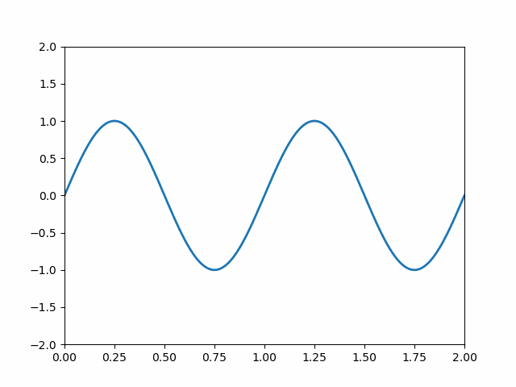
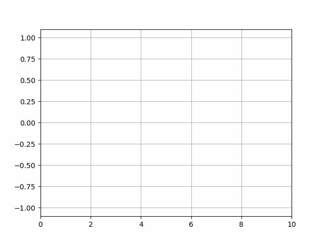
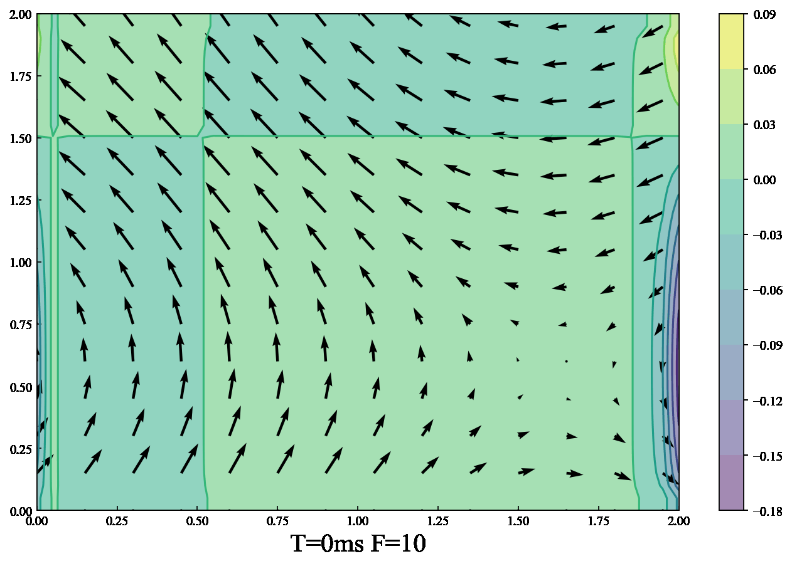
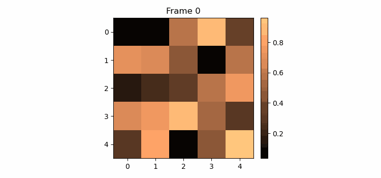
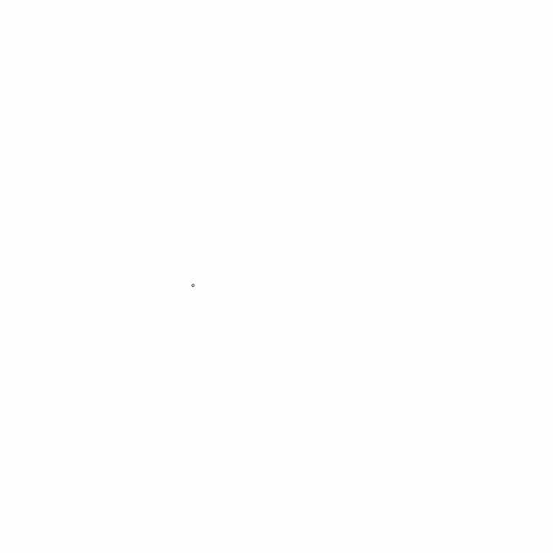
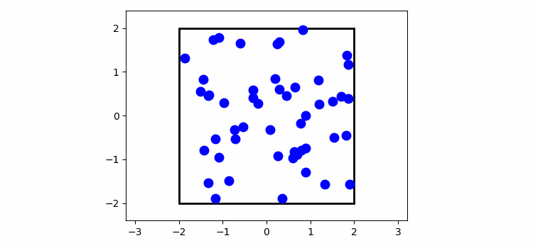

# Projects description

**Purpose:** This is my notes for using Matplotlib to make animation, it's very convenient during your simulation. 

**Reference**

[1] [Official example](https://matplotlib.org/stable/api/animation_api.html)

[2] [Official web](https://matplotlib.org/stable/api/animation_api.html)

[3] [Blog](https://jakevdp.github.io/blog/2012/08/18/matplotlib-animation-tutorial/)

## Basic Animation

Firstly, let's try some basic case, using the [`FuncAnimation`](https://matplotlib.org/stable/api/_as_gen/matplotlib.animation.FuncAnimation.html) tool.

```python
def __init__(self, fig, func, frames=None, init_func=None, fargs=None,
                 save_count=None, **kwargs):
```

For `FuncAnimation` class, it requires some parameters like,  

`figure`,the figure object in Matplotlib

 `func`(callable), it's a callable function, used to update the object at each frame.

 `frames`, source of data to pass `func` and each frame of the animation

 `init_func`, A function used to draw a clear frame. 

The most important parameters are `func` and `frames`, so we will introduce them in details.

### frames

`frames` is the source of data to pass `func` and each frame of the animation, and it can be iterable, int, generator function, or None.

1. Iterable:

```python
frames=np.linspace(-np.pi,np.pi, 90)
```
Above is an example of `frames` being a list(iterable), ranging from $[-\pi, \pi]$ with 90 frames

2. int:

```python
frames=200
```
This example is from the case1 below, it means there are 200 frames in the final animation. 

3. None:
This equivalent to passing `itertools.count`

4. generator function

This is a little complex, for passing a generator as `frames`, the generator must be like
```python
def gen_function() -> obj
```
No input parameters in generator, but one output for passing into `func`


### func

`func` is a callable function, used to update the object at each frame. It should be like this:

```python
def func(frame, *fargs) -> iterable_of_artists
```

So, we always use it to update the figure, such as the following example: 

```python
def update(frame):
    xdata.append(frame)
    ydata.append(np.sin(frame))
    ln.set_data(xdata, ydata)
    return ln,

```

### Generally

`frames` determine the range of frames in animation, it will iterate one time during a interval and then passes the value to `func`, until the entire Frames has iterated. 

## Code case

### Case 1: Simple moving $sin$


```python
import itertools
import numpy as np
from matplotlib import pyplot as plt
from matplotlib import animation
# First set up the figure, the axis, and the plot element we want to animate
fig = plt.figure()
ax = plt.axes(xlim=(0, 2), ylim=(-2, 2))
line, = ax.plot([], [], lw=2)

# then, initialization function: plot the background of each frame
def init():
    line.set_data([], [])
    return line,

# afterwards, set the animation function.  This is called sequentially
def animate(i):
    x = np.linspace(0, 2, 1000)
    y = np.sin(2 * np.pi * (x - 0.01 * i))
    line.set_data(x, y)
    return line,

anim = animation.FuncAnimation(fig, animate, init_func=init,
                               frames=None, interval=20, blit=True)
anim.save('./fig/case1.gif', fps=30)
```


### Case 2: Decay

```python
def data_gen():
    for cnt in itertools.count():
        t = cnt / 10
        yield t, np.sin(2*np.pi*t) * np.exp(-t/10.)


def init():
    ax.set_ylim(-1.1, 1.1)
    ax.set_xlim(0, 10)
    del xdata[:]
    del ydata[:]
    line.set_data(xdata, ydata)
    return line,

fig, ax = plt.subplots()
line, = ax.plot([], [], lw=2)
ax.grid()
xdata, ydata = [], []


def run(data):
    # update the data
    t, y = data
    xdata.append(t)
    ydata.append(y)
    xmin, xmax = ax.get_xlim()

    if t >= xmax:
        ax.set_xlim(xmin, 2*xmax)
        ax.figure.canvas.draw()
    line.set_data(xdata, ydata)

    return line,
# herein, run is the func, data_gen is the frames
ani = animation.FuncAnimation(fig, run, data_gen, interval=10, init_func=init)
ani.save('./fig/case2.gif', fps=30)

```


### Case 3: Using figure as flame

I don't recommend you use `matplotlib` to make animation based on figures already exits, as the advantage of `matplotlib` is the rendering figures. 

Instead of `matplotlib`, you can use `os` and `imageio` to make animation based on figures. 

```python

import os
import imageio
 
def create_gif(image_list, gif_name):
 
    frames = []
    for image_name in image_list:
        if image_name.endswith('.tif'):
            print(image_name)
            frames.append(imageio.imread(image_name))
    # Save them as frames into a gif
    imageio.mimsave(gif_name, frames, 'GIF', duration = 0.1)
 
    return
 
def main():
 
    path=r'./fig/frames/'
    image_list=[ path+img for img in  os.listdir(path)]
    gif_name = os.listdir(path)[-1][:-4]+'.gif'
    create_gif(image_list, gif_name)
 
if __name__ == "__main__":
    main()

```



### Case 4 : using colorbar

In this case, we try to add colorbar to a gif. It's kind of tricky, as it may be 

```python
import numpy as np
import matplotlib.pyplot as plt
import matplotlib.animation as animation
from mpl_toolkits.axes_grid1 import make_axes_locatable

plt.rcParams["figure.figsize"] = [7.50, 3.50]
plt.rcParams["figure.autolayout"] = True

fig = plt.figure()

ax = fig.add_subplot(111)
div = make_axes_locatable(ax)
cax = div.append_axes('right', '5%', '5%')
data = np.random.rand(5, 5)
im = ax.imshow(data)
cb = fig.colorbar(im, cax=cax)
tx = ax.set_title('Frame 0')
cmap = ["copper", 'RdBu_r', 'Oranges', 'cividis', 'hot', 'plasma']

def animate(i):
   cax.cla()
   data = np.random.rand(5, 5)
   im = ax.imshow(data, cmap=cmap[i%len(cmap)])
   fig.colorbar(im, cax=cax)
   tx.set_text('Frame {0}'.format(i))
ani = animation.FuncAnimation(fig, animate, frames=10)
ani.save('./fig/case5.gif', fps=30)
```



### Case 5: Raindrops

This case is more complexed than above. Firstly, we should generate the data, then use animation to render those data. 

```python
# Fixing random state for reproducibility
np.random.seed(19680801)


# Create new Figure and an Axes which fills it.
fig = plt.figure(figsize=(7, 7))
ax = fig.add_axes([0, 0, 1, 1], frameon=False)
ax.set_xlim(0, 1), ax.set_xticks([])
ax.set_ylim(0, 1), ax.set_yticks([])

# Create rain data
n_drops = 50
rain_drops = np.zeros(n_drops, dtype=[('position', float, (2,)),
                                      ('size',     float),
                                      ('growth',   float),
                                      ('color',    float, (4,))])

# Initialize the raindrops in random positions and with
# random growth rates.
rain_drops['position'] = np.random.uniform(0, 1, (n_drops, 2))
rain_drops['growth'] = np.random.uniform(50, 200, n_drops)

# Construct the scatter which we will update during animation
# as the raindrops develop.
scat = ax.scatter(rain_drops['position'][:, 0], rain_drops['position'][:, 1],
                  s=rain_drops['size'], lw=0.5, edgecolors=rain_drops['color'],
                  facecolors='none')


def update(frame_number):
    # Get an index which we can use to re-spawn the oldest raindrop.
    current_index = frame_number % n_drops

    # Make all colors more transparent as time progresses.
    rain_drops['color'][:, 3] -= 1.0/len(rain_drops)
    rain_drops['color'][:, 3] = np.clip(rain_drops['color'][:, 3], 0, 1)

    # Make all circles bigger.
    rain_drops['size'] += rain_drops['growth']

    # Pick a new position for oldest rain drop, resetting its size,
    # color and growth factor.
    rain_drops['position'][current_index] = np.random.uniform(0, 1, 2)
    rain_drops['size'][current_index] = 5
    rain_drops['color'][current_index] = (0, 0, 0, 1)
    rain_drops['growth'][current_index] = np.random.uniform(50, 200)

    # Update the scatter collection, with the new colors, sizes and positions.
    scat.set_edgecolors(rain_drops['color'])
    scat.set_sizes(rain_drops['size'])
    scat.set_offsets(rain_drops['position'])


# Construct the animation, using the update function as the animation director.
ani = animation.FuncAnimation(fig, update, interval=10)
ani.save('./fig/case6.gif', fps=30)
```


### Case 6: Particles in box $^{[3]}$

This is also a simulation case, so, remember to separate data generation and animation.

This code simulates the elastic collisions of a group of particles in a box under the force of gravity. The collisions are elastic: they conserve energy and 2D momentum, and the particles bounce realistically off the walls of the box and fall under the influence of a constant gravitational force.

```python
import scipy.integrate as integrate
from scipy.spatial.distance import pdist, squareform

class ParticleBox:
    """Orbits class
    
    init_state is an [N x 4] array, where N is the number of particles:
       [[x1, y1, vx1, vy1],
        [x2, y2, vx2, vy2],
        ...               ]

    bounds is the size of the box: [xmin, xmax, ymin, ymax]
    """
    def __init__(self,
                 init_state = [[1, 0, 0, -1],
                               [-0.5, 0.5, 0.5, 0.5],
                               [-0.5, -0.5, -0.5, 0.5]],
                 bounds = [-2, 2, -2, 2],
                 size = 0.04,
                 M = 0.05,
                 G = 9.8):
        self.init_state = np.asarray(init_state, dtype=float)
        self.M = M * np.ones(self.init_state.shape[0])
        self.size = size
        self.state = self.init_state.copy()
        self.time_elapsed = 0
        self.bounds = bounds
        self.G = G

    def step(self, dt):
        """step once by dt seconds"""
        self.time_elapsed += dt
        
        # update positions
        self.state[:, :2] += dt * self.state[:, 2:]

        # find pairs of particles undergoing a collision
        D = squareform(pdist(self.state[:, :2]))
        ind1, ind2 = np.where(D < 2 * self.size)
        unique = (ind1 < ind2)
        ind1 = ind1[unique]
        ind2 = ind2[unique]

        # update velocities of colliding pairs
        for i1, i2 in zip(ind1, ind2):
            # mass
            m1 = self.M[i1]
            m2 = self.M[i2]

            # location vector
            r1 = self.state[i1, :2]
            r2 = self.state[i2, :2]

            # velocity vector
            v1 = self.state[i1, 2:]
            v2 = self.state[i2, 2:]

            # relative location & velocity vectors
            r_rel = r1 - r2
            v_rel = v1 - v2

            # momentum vector of the center of mass
            v_cm = (m1 * v1 + m2 * v2) / (m1 + m2)

            # collisions of spheres reflect v_rel over r_rel
            rr_rel = np.dot(r_rel, r_rel)
            vr_rel = np.dot(v_rel, r_rel)
            v_rel = 2 * r_rel * vr_rel / rr_rel - v_rel

            # assign new velocities
            self.state[i1, 2:] = v_cm + v_rel * m2 / (m1 + m2)
            self.state[i2, 2:] = v_cm - v_rel * m1 / (m1 + m2) 

        # check for crossing boundary
        crossed_x1 = (self.state[:, 0] < self.bounds[0] + self.size)
        crossed_x2 = (self.state[:, 0] > self.bounds[1] - self.size)
        crossed_y1 = (self.state[:, 1] < self.bounds[2] + self.size)
        crossed_y2 = (self.state[:, 1] > self.bounds[3] - self.size)

        self.state[crossed_x1, 0] = self.bounds[0] + self.size
        self.state[crossed_x2, 0] = self.bounds[1] - self.size

        self.state[crossed_y1, 1] = self.bounds[2] + self.size
        self.state[crossed_y2, 1] = self.bounds[3] - self.size

        self.state[crossed_x1 | crossed_x2, 2] *= -1
        self.state[crossed_y1 | crossed_y2, 3] *= -1

        # add gravity
        self.state[:, 3] -= self.M * self.G * dt


#------------------------------------------------------------
# set up initial state
np.random.seed(0)
init_state = -0.5 + np.random.random((50, 4))
init_state[:, :2] *= 3.9

box = ParticleBox(init_state, size=0.04)
dt = 1. / 30 # 30fps


#------------------------------------------------------------
# set up figure and animation
fig = plt.figure()
fig.subplots_adjust(left=0, right=1, bottom=0, top=1)
ax = fig.add_subplot(111, aspect='equal', autoscale_on=False,
                     xlim=(-3.2, 3.2), ylim=(-2.4, 2.4))

# particles holds the locations of the particles
particles, = ax.plot([], [], 'bo', ms=6)

# rect is the box edge
rect = plt.Rectangle(box.bounds[::2],
                     box.bounds[1] - box.bounds[0],
                     box.bounds[3] - box.bounds[2],
                     ec='none', lw=2, fc='none')
ax.add_patch(rect)

def init():
    """initialize animation"""
    global box, rect
    particles.set_data([], [])
    rect.set_edgecolor('none')
    return particles, rect

def animate(i):
    """perform animation step"""
    global box, rect, dt, ax, fig
    box.step(dt)

    ms = int(fig.dpi * 2 * box.size * fig.get_figwidth()
             / np.diff(ax.get_xbound())[0])
    
    # update pieces of the animation
    rect.set_edgecolor('k')
    particles.set_data(box.state[:, 0], box.state[:, 1])
    particles.set_markersize(ms)
    return particles, rect

ani = animation.FuncAnimation(fig, animate, frames=600,
                              interval=10, blit=True, init_func=init)

ani.save('./fig/case7.gif', fps=30)

#ani.save('particle_box.mp4', fps=30, extra_args=['-vcodec', 'libx264'])
```


