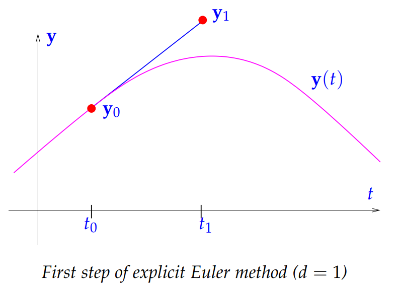
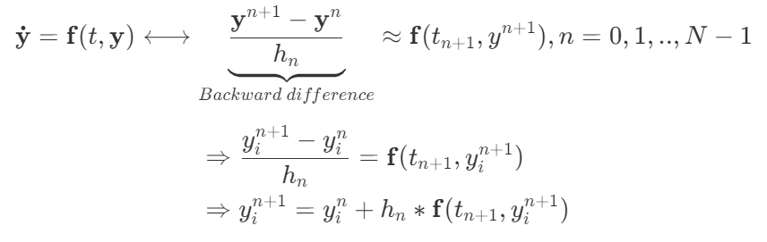
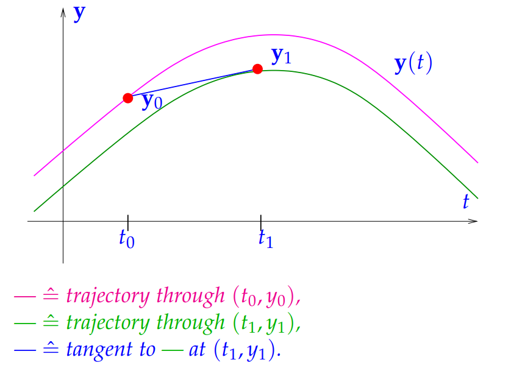
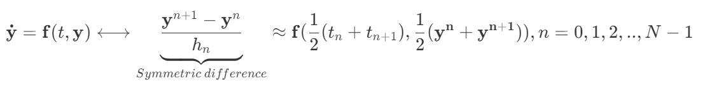
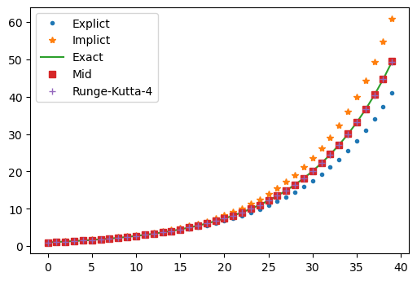

# Projects description

**Purpose:** This is my notes for the approximation methods of timestepping, including explicit Euler method, 

**Reference:**
Some part of this notes is based on the book "Numerical Methods for Computational Science and Engineering" 

# Problem description

That is, the initial conditions and the differential equation (time derivative) are given, then the solution can be given by time stepping.

$$\mathbf {\dot{y}}=\mathbf{f}(t,\mathbf{y}),\space{} \mathbf{y(t_0)}=\mathbf{y_0}$$
We can calculate the $\mathbf{y}$ on a temporal mesh covering the time interval between initial time $t_0$ and final time $T$.

$$(\mathbf{y}^{n},h^{n}) \mapsto \mathbf{\Psi}(\mathbf{y}^{n},h^{n})=\mathbf{y}^{n+1}$$
$\mathbf{\Psi}$ stands for the operator of discretization. 

其实所有的时间推进如果按相似的离散方式表示，均为：
下个时间步结果=上个时间步的数据+时间步长*斜率，接下来即将介绍的各种方法的区别仅为对斜率的构造方法不同。

$$\begin{aligned}
& \frac{y^{n+1}_i-y^{n}_i}{dt}=\mathbf{f}(t,\mathbf{y}) \\
& \Rightarrow y^{n+1}_i=y^{n}_i+dt*\mathbf{f}(t,\mathbf{y}) \end{aligned}$$

# Method descrition
Assuming $$h_n=t_{n+1}-t_n$$
The $\mathbf{\dot{y}}$ stands for the differential $\mathbf{y}$ with time, $\mathbf{y}$ is the value tensor, $y_i$ is the i components. 

In this note, the subscript($a_i$) stands for the spatial discretization and the superscript($a^n$) stands for the time discretization. 

## Explict Euler method
Explict Euler method is based on forward difference quotient: 

$$\mathbf{\dot{y}}=\mathbf{f}(t,\mathbf{y})\longleftrightarrow \underbrace{\frac{\mathbf{y}^{n+1}-\mathbf{y}^{n}}{h_n}}_{Forward \space{} difference}\approx \mathbf{f}(t_n,\mathbf{y^{n}}), n=0,1,2,..,N-1$$


$$\begin{aligned}
&\Rightarrow \frac{y^{n+1}_i-y^{n}_i}{h_n}=\mathbf{f}(t_n,y_i^{n}) \\
& \Rightarrow y^{n+1}_i=y^{n}_i+h_n*\mathbf{f}(t,y_i^{n}) \end{aligned}$$

**说明：** 显然，此时未知数仅是$y^{n+1}_i$，而等式右边的均为已知数，故直接通过等式求出未知数，进行时间推进即可。

对于CFD问题，$\mathbf{f}$通常是一个与物理量相关的空间离散量，通过初始条件、边界条件，能够得到全场在初始时刻的各物理信息，即能获得等式右边的值，而基于该结果，进行计算，即可获得下一个时刻的物理量，以此进行时间推进。

**理解：** 由图可知，此时的斜率是在$(t_0,y_0)$取得的，基于该斜率估算下一个时间步结果，如果dt较大，将会带来显著误差。





**优劣：** 推导简单，编程简单，且利于并行，但容易耗散，需要小时间步长(CFL)
简单说"小步快走易并行"

## Implict Euler method

Implict Euler method is based on backward difference quotient: 


<!-- 
$$\mathbf{\dot{y}}=\mathbf{f}(t,\mathbf{y})\longleftrightarrow \underbrace{\frac{\mathbf{y}^{n+1}-\mathbf{y}^{n}}{h_n}}_{Backward \space{} difference}\approx \mathbf{f} ( t_{n+1},y^{n+1}) , n=0,1,..,N-1$$

$$\begin{aligned}
&\Rightarrow \frac{y^{n+1}_i-y^{n}_i}{h_n}=\mathbf{f} \left (t_{n+1},y^{n+1}_i \right ) \\
& \Rightarrow y^{n+1}_i=y^{n}_i+h_n*\mathbf{f}(t_{n+1},y^{n+1}_i) \end{aligned}$$ -->


**说明:** 显然，此时等式左右两边均出现了未知数$y^{n+1}_i$，由于$\mathbf{f}$是已知的，故通常做法是将等式右边的$y^{n+1}_i$移到等式左边，再经过变形，获得一组方程组，联立方程组进行求解。

**理解：** 此时的斜率是在$(t_1,y_1)$取得的，故能够对$y_1$进行较好地还原，但该斜率暂时是未知的，故唯一的问题是需要求解方程组获得





**优劣：** 推导较为复杂，编程复杂，且容易出现非线性(例如某个参数也是时间相关的，该参数乘上时间突进的物理量，将使得未知量的维度变为2)，加大了求解的难度，且不利于并行，但不容易耗散，可以大时间步长(CFL)
简单说"大步慢走难并行"

## Implicit midpoint 

Implicit midpoint method is based on a symmetric difference quotient, 
$$\mathbf{\dot{y}}=\mathbf{f}(t,\mathbf{y})\longleftrightarrow \underbrace{\frac{\mathbf{y}^{n+1}-\mathbf{y}^{n-1}}{2h_n}}_{Symmetric \space{} difference}, n=0,1,2,..,N-1$$

Then apply this formula in $t=\frac{1}{2}(t_k+t_{K+1})$



<!-- $$\mathbf{\dot{y}}=\mathbf{f}(t,\mathbf{y})\longleftrightarrow \underbrace{\frac{\mathbf{y}^{n+1}-\mathbf{y}^{n}}{h_n}}_{Symmetric \space{} difference}\approx \mathbf{f}(\frac{1}{2}(t_n+t_{n+1}),\frac{1}{2}(\mathbf{y^{n}}+\mathbf{y^{n+1}})), n=0,1,2,..,N-1$$ -->


**理解：** 此时的斜率是在在$(t^*,y^*)$取得的，该点依然是未知的，但是基于已知和位置点共同构造的（暂时不知道好处在哪里）


## Runge-Kutta method

欧拉显示和欧拉隐式的精度都是一阶，而Runge-Kutta通过几次构造半时间步，获得了四阶精度，但龙格库塔本质上还是一个显示方法，并不涉及任何方程组的求解，可以理解为通过四次构造斜率，使得斜率最接近真实值

$$ \mathbf{y}^{n+1}=\mathbf{y}^{n}+\frac{dt}{6}(k_1+2k_2+2k_3+k_4) $$

$$ k_1=\mathbf{f}(t_n,\mathbf{y}_n) $$
$$ k_2=\mathbf{f}(t_n+\frac{dt}{2},\mathbf{y}_n+\frac{dt}{2}k_1) $$
$$ k_3=\mathbf{f}(t_n+\frac{dt}{2},\mathbf{y}_n+\frac{dt}{2}k_2)$$
$$ k_4=\mathbf{f}(t_n+dt,\mathbf{y}_n+dtk_3)$$

<!-- $$\begin{aligned}
& \mathbf{y}^{n+1}=\mathbf{y}^{n}+\frac{dt}{6}(k_1+2k_2+2k_3+k_4) \\
&k_1=\mathbf{f}(t_n,\mathbf{y}_n) \\
&k_2=\mathbf{f}(t_n+\frac{dt}{2},\mathbf{y}_n+\frac{dt}{2}k_1) \\
&k_3=\mathbf{f}(t_n+\frac{dt}{2},\mathbf{y}_n+\frac{dt}{2}k_2) \\
&k_4=\mathbf{f}(t_n+dt,\mathbf{y}_n+dtk_3)
\end{aligned}$$ -->


# Case: simple function

## Description

Take this simple function as an example to demonstrate how those methods work. 

$$\mathbf{\dot{y}}=y, y^0=1$$
Obviously, this function has exact solution.
$$y=y^0+e^{t}$$

For explict method:
$$y^{n+1}=y^n+dt*y^n$$

For implict method:
$$y^{n+1}=y^n+dt*y^{n+1}\longrightarrow y^{n+1}=\frac{y^n}{1-dt}$$

For implict midpoint method:
$$y^{n+1}=y^n+dt*\frac{y^{n+1}+y^{n}}{2} \longrightarrow y^{n+1}=\frac{1+\frac{1}{2}dt}{1-\frac{1}{2}dt}y^n$$

For Runge-Kutta-4 method:

$$ \mathbf{y}^{n+1}=\mathbf{y}^{n}+\frac{dt}{6}(k_1+2k_2+2k_3+k_4) $$

$$ k_1=\mathbf{f}(t_n,\mathbf{y}_n) $$
$$ k_2=\mathbf{f}(t_n+\frac{dt}{2},\mathbf{y}_n+\frac{dt}{2}k_1) $$
$$ k_3=\mathbf{f}(t_n+\frac{dt}{2},\mathbf{y}_n+\frac{dt}{2}k_2)$$
$$ k_4=\mathbf{f}(t_n+dt,\mathbf{y}_n+dtk_3)$$

In this code, explict method, implict method, implicit midpoint and the exact solution have been calculated and presented in figure. 

## Code

```python
# -*- coding: utf-8 -*-
"""
Created on Mon Sep 12 16:05:01 2022

@author: Howw
"""
import numpy as np
import matplotlib.pyplot as plt

step=40
dt=.1

y_explict=np.zeros([step])
y_exact=np.zeros([step])
y_implict=np.zeros([step])
y_mid=np.zeros([step])
y_runge=np.zeros([step])

y_explict[0]=1
y_implict[0]=1
y_mid[0]=1
y_exact[0]=1
y_runge[0]=1

def result(y):
    return y;

#Exact solution
for i in range(1,step):
    y_exact[i]=y_exact[0]*np.exp(i*dt)

#Explicit Euler
for i in range(1,step):
    y_explict[i]=y_explict[i-1]+dt*result(y_explict[i-1])
    
#imexplicit Euler
for i in range(1,step):
    y_implict[i]=y_implict[i-1]/(1-dt)
    
#Implicit midpoint
for i in range(1,step):
    y_mid[i]=((1+1/2*dt)/(1-1/2*dt))*y_mid[i-1]

#Runge-Kutta
for i in range(1,step):
    k1=y_runge[i-1]
    k2=y_runge[i-1]+k1*dt/2
    k3=y_runge[i-1]+k2*dt/2
    k4=y_runge[i-1]+k3*dt
    y_runge[i]=y_runge[i-1]+dt/6*(k1+2*k2+2*k3+k4)

    
plt.plot(y_explict,".",label="Explict")
plt.plot(y_implict,"*",label="Implict")
plt.plot(y_exact,label="Exact")
plt.plot(y_mid,"s",label="Mid")
plt.plot(y_runge,"+",label="Mid")
plt.legend()
plt.savefig("./result.png",dpi=100,bbox_inches="tight")
```



